# 并发编程模型


并发编程的意义，这个不需要多说了，大流量，高并发全靠它，性能上来了，稳定性也就不言而喻了

并发的两个基础部分：

1. 并发调度单位，concurrency unit 
2. 并发模型，concurrency model

## Concurrency unit

并发调度单位讲究 轻！快！

unit占用轻！unit切换快！

### 进程作为Unit

进程拥有独占的内存和指令流，是一个应用的包装，但是进程作为并发基本单元有如下问题：

1. 资源占用过大
   1. 每个进程占用的内存太大了，进程携带了自己的虚拟内存页表，文件描述符等
2. 不能发挥多核的性能
   1. 进程不能很好的发挥多核机器的性能，常常出现一个核跑，多个核看的现象
   2. 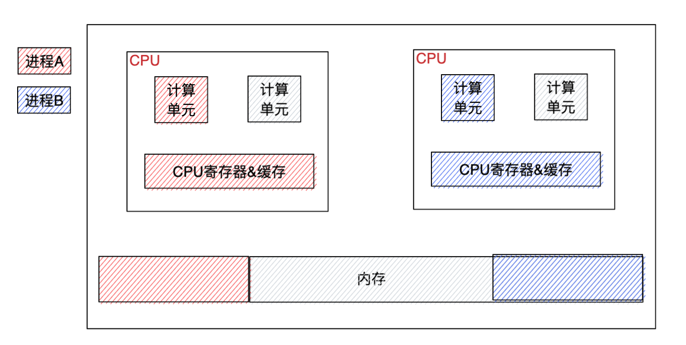
3. 进程切换消耗过大
   1. 进程切换需要进行系统调用，涉及到内存从用户态拷贝至内核态
   2. 保存当前进程的现场，并且恢复下一个进程


### 线程作为Unit

线程较轻量级，一个进程可以包含多个线程，则每个最小并发粒度的资源占用要小很多，且同一个进程内线程间切换只需要对指令流进行切换即可。

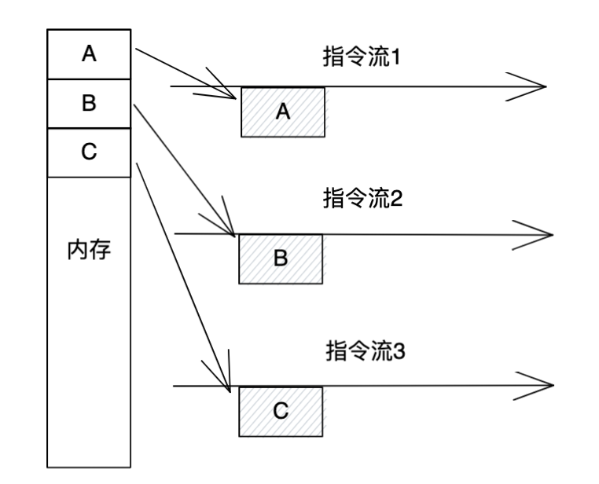

但是，进程间切换仍需要进入内核进行，仍然存在大量的并发切换消耗

### 协程作为Unit

协程，也叫做**用户态线程**，它规避了最后一个问题，切换消耗过大的问题，无需通过系统调用进入内核进行切换，协程所有的生命周期均发生在用户态。

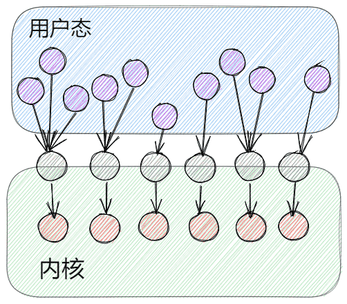

因为协程的优点，协程类编程也开始越来越火了。比较有代表性的有Go的goroutine、Erlang的Erlang进程、Scala的actor、windows下的fibre（纤程）等，一些动态语言像Python、Ruby、Lua也慢慢支持协程。

**但是** 语言引入协程作为并发调度单位，需要实现自己的协程调度器、并提供协程间通信的方式等一系列支持模块，相较于传统的基于进程线程的并发方式，需要实现很多额外的功能组件。**实现较复杂。**

## Concurrency model

总体来看，目前能找到的最轻量的调度单元就是协程了，虽然实现起来有些麻烦，但是现代语言也越来越多的引入协程了。

那么解决了并发单元的问题后，我们再研究下并发模型，为什么需要并发模型呢，因为**并发就意味着竞争**：对内存的竞争，对算力的竞争等，那么如何降低竞争带来的性能损耗，就需要并发模型的设计了。简单来说，并发模型就是指导并发单元以何种方式处理竞争，尽量减少竞争带来的性能损耗。简单来说，就是**定义了并发单元间的通信方式**。

### 共享内存+锁

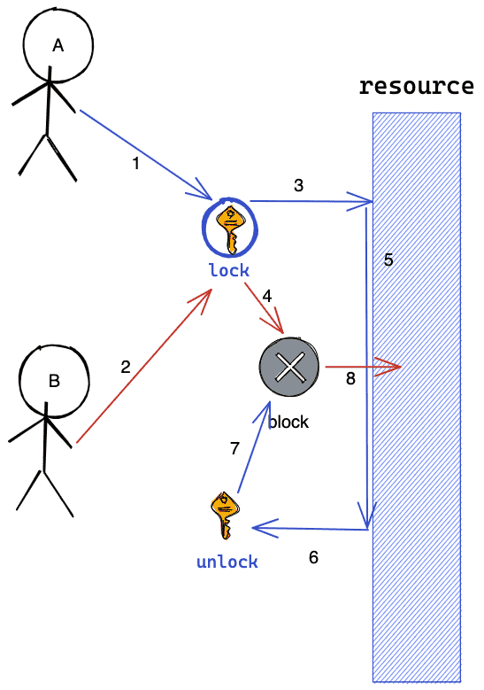

最经典的模型，通过锁来保护资源，多个并发单元访问资源前首先争夺锁，然后再去访问资源。没抢到锁的unit则阻塞等待。

这个应该是目前最常用的了，也最符合直觉，但是可以明显看到，在竞争时会产生**阻塞耗时**。

**这就是常说的使用共享内存来进行通信**

### 函数式编程

**既然基于共享内存通信会产生大量的竞争，那么函数式编程的通信思想是，在并发单元执行过程中不进行通信，只在最后大家都执行完后统一对结果做收集和汇总**


函数式编程的特性：

1. 不可变数据，默认是变量是不可变的，如果你要改变变量，你需要把变量copy出去
2. 函数对于Input A一定会返回Output B，即**函数内部没有状态**，不会对全局变量进行修改，运行时涉及的变量都是局部变量
3. 这么一来，每个函数对输入负责，只会访问局部变量，全局不存在资源竞争

基于函数式编程模型作为并发模型的话，性能会很高，但是会产生额外的大量的局部变量

**代表语言：clojure**

#### 举个例子：

s3e在设计之初，提供了一套SDK，目的是帮助业务建模和模型可视化，大体是这样的，将一个业务功能节点抽象为了workflow，workflow中的每个task state对应一个函数，为了降低使用成本，各个函数的签名都是一致的

```go
func Action(ctx context.Context, db *Databus) (*Databus, error)
```

每个函数都会对Databus做一些自己的修改，这个修改是全局Action可见的（因为Databus传的是指针类型），因此如果存在并发的节点，会存在对全局变量的锁竞争。

但是在接入业务需求时，这套设计还好，不会产生太大的问题，但是在接入拦截系统时，由于拦截系统的比较大的诉求是希望引入并发带来对耗时的优化，如果仍然采用这种粗粒度锁的方式，竞争会比较大，可预见的性能优化不会太明显，如图

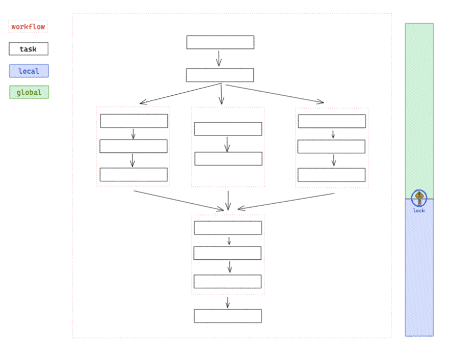

```go
type Data struct {
    input         *Input
  collector *ChekerCollector
}

type CheckerCollector struct {
  lock             sync.Lock
    data map[string]*CheckRes
}

func (cc *CheckerCollector) Report(key string, res *CheckRes) {
  cc.lock.Lock()
  map[key] = res
  cc.lock.Unlock()
}
```

那么，采用函数式编程的思路，我们把databus尽量减少写操作，将需要写的字段分配到每个并发节点的运行时局部变量中，然后再对每个并发节点的结果做统一的收集，可以很好的减少并发竞争

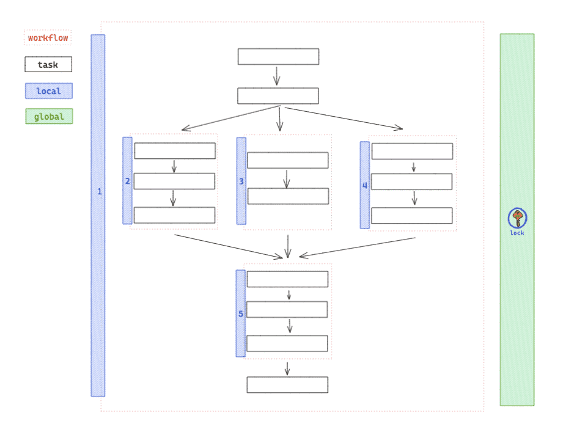

### Actor

那么，我们回归到通信本身，有没有更好的通信方式呢？

Actor的主要思路是，每个并发单元抽象为actor，每个actor都拥有一个邮箱**，所有actor间的通信都会异步的发送到对方的邮箱中**，这样**解耦了actor**之间的关系，各个actor都能按照自己的步调进行执行，但是他们会按照邮箱中消息的发送顺序来依次处理消息，当且仅当前一个消息处理完成后，才会开始下一个消息处理，即**保障了消息的时序性**。

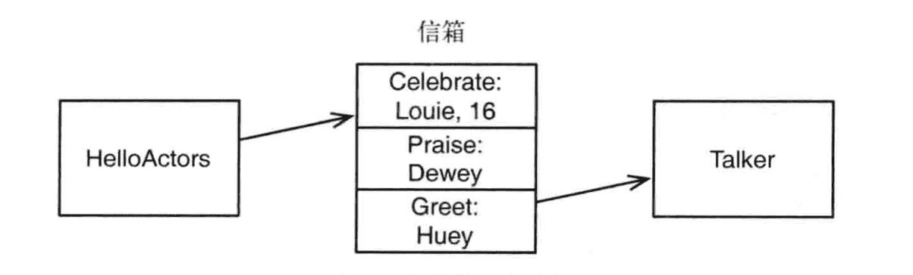

这样的话，在并发单元执行过程中，也不会存在锁资源的竞争，但是由于发送过程是异步的，即只将消息放入目标actor的邮箱中即完成了发送操作，但是消息什么时候会被目标actor处理，则是不可预测的。

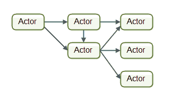

**代表语言：erlang，scala的akka库**

### CSP

csp的降低竞争的思想大体和actor保持一致，但是在消息发送上则采用了同步的方式，且与actor不同的是，csp关注的不是发送接受者，而是发送的媒介。

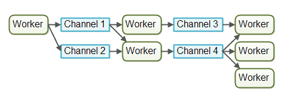

并发单元间通过一个FIFO队列（channel）来进行通信，而不是直接和目标单元进行通信。

#### actor和csp的区别

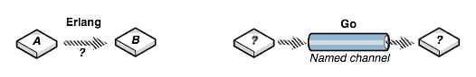

1. actor的并发单元之间直接通信，csp则通过channel通信，后者显然耦合更松散
2. csp的消息交换是同步的，actor则是完全异步，可以在任意时间点发送消息到任何并发单元（甚至不存在的），并且actor可以自由选择处理哪些消息
3. 相应的，csp的channel空间可以使有限的，而actor的邮箱理论上是需要无限大的
4. actor关注的是并发单元，而csp关注的则是channel

### 现实

现实上，几乎所有并发编程语言**都支持锁+共享内存**的形式进行并发单元通信，而对于支持函数式编程，actor和csp等概念的大部分语言，并没有严格完全按照模型定义实现，都在使用上或多或少的做了一些折中。

# channel

步入正题！

那么，显然golang深受csp模型的影响，channel和gorutinue是golang中的一等公民。

但是它又没有完全按照CSP理论中的channel来实现，CSP中的channel是一个纯粹的同步信道，而go channel不仅支持同步式通信，而且支持非同步式信道。

我们已经知道，channel本质上就是一个**有锁的并发安全的FIFO消息队列**，他负责在gorutinue之间传递消息。

## Doc

### 1.类型

```go
ChannelType = ( "chan" | "chan" "<-" | "<-" "chan" ) ElementType .
```

包含三种类型的定义，可选的'<-'代表了channel的方向，如果没有指定方向，channel就是双向的，可以接受数据，也可以发送数据。

举个例子：

```go
    var ch1 chan int   // 声明一个传递整型的通道
    var ch2 chan bool  // 声明一个传递布尔型的通道
    var ch3 chan []int // 声明一个传递int切片的通道
```

并且，channel还分为带缓冲区和不带缓冲区两种类型

#### 无缓冲channel

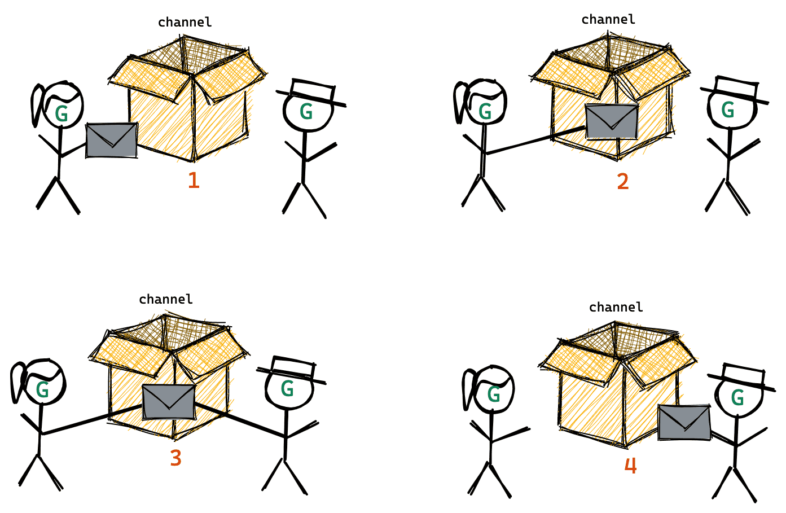

无缓冲区的channel又叫做阻塞channel，举个例子

```go
func main() {
    ch := make(chan int)
    ch <- 9527
    fmt.Println("OK")
}
```

上面这段代码👆，执行时会报错吗

```
$ go run main.go
fatal error: all goroutines are asleep - deadlock!

goroutine 1 [chan send]:
main.main()
        /home/xiaoju/gulf/test/main.go:7 +0x54
exit status 2
```

简单来说，阻塞式的channel是需要先有接收者才能发送的，否则会一直阻塞，改进：

```go
func recv(c chan int) {
    ret := <-c
    fmt.Println("recv ok", ret)
}
func main() {
    ch := make(chan int)
    go recv(ch) // 启用goroutine从通道接收值
    ch <- 10
    fmt.Println("ok")
}
```

反之，当只有发送者时，发送者也会阻塞，等待接收者到来才能发送，因此，使用无缓冲channel进行通信将导致**发送和接收的goroutine同步化**，因此无缓冲channel也称为**同步channel**。

#### 有缓冲的channel

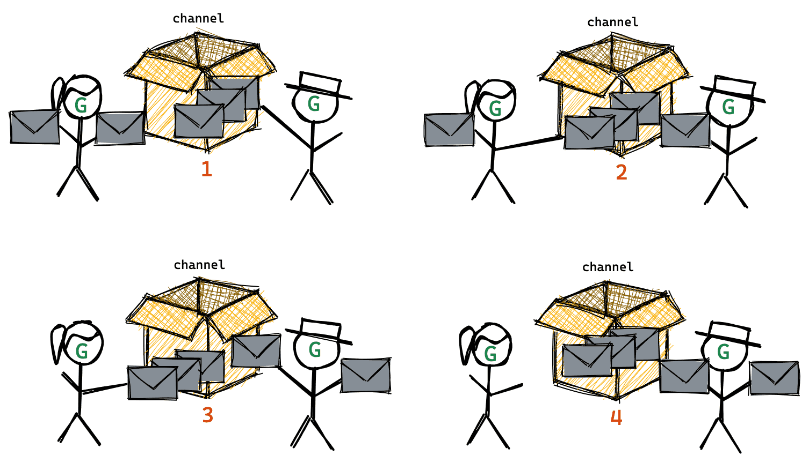

我们可以在channel初始化时声明其容量

```go
func main() {
    ch := make(chan int, 1) // 创建一个容量为1的有缓冲区通道
    ch <- 10
    fmt.Println("OK")
}
```

只要缓冲区未满，则发送者发送消息不回阻塞，直到缓冲区满了之后，发送者发送消息才会阻塞，反之，缓冲区不空，接收者接收消息不阻塞，缓冲区空，接收者接收消息阻塞。

所以，基于以上两种类型的channel，我们可以知道，channel可以用来在goroutine之间进行消息传递，并且我们还可以利用unbuffer channel来做goroutine同步。

### 2.创建

channel是引用类型，channel的空值为nil

```go
var ch chan int
fmt.Println(ch) // <nil>
```

所以，通道在初始化后，还需要使用make函数进行初始化后才能使用

```
make(chan 元素类型, [缓冲大小])
```

缓冲区大小可选，举个例子

```go
ch4 := make(chan int)
ch5 := make(chan bool 10)
ch6 := make(chan []int 1)
```

### 3.发送

```go
ch <- 10 //将10发送到channel中
```

##### 不阻塞

buffer channel：缓冲区未满时

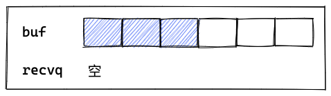

unbuffer channel：存在接收者时


##### 阻塞

ch == nil

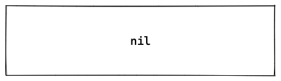

buffer channel：缓冲区已满

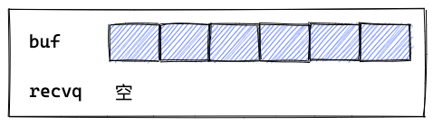

unbuffer channel：不存在接受者

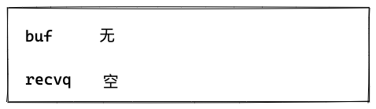

##### 不想阻塞

```go
select {
    case ch <- 10:
        xxxxx
    default:
        xxxx
}
```

### 4.接收

```go
x, ok := <- ch //comma ok风格，判断ch是否已经关闭，x为ch元素类型零值
x := <- ch //从chan中接受值并赋值给x
<- ch //从ch中接收值并忽略，常用于消息通知
```

##### 不阻塞

buffer channel：缓冲区不为空时

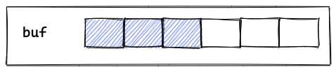

unbuffer channel：存在发送者时

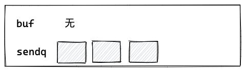

##### 阻塞

ch == nil


unbuffer channel：不存在发送者时

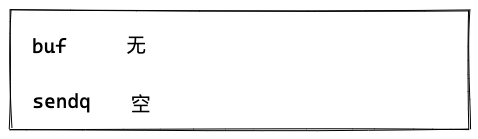

buffer channel：缓冲区为空且不存在发送者

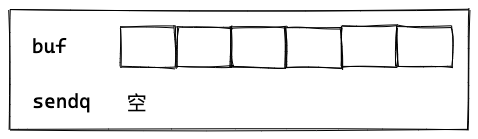

##### 不想阻塞

```go
select {
    case <-ch:
        xxxx
    default:
        xxxx
}
```

### 5.多路select

```go
select {
    case a := <- ch1:
        xxxx
    case ch2 <- b:
        xxx
    //default: 可选
}
```

同时监听多个chan

### 6.关闭

```go
close(ch)    
```

Tips：

只有在需要通知接收方所有数据已经发送完毕时，才需要显式的调用close函数关闭chan，除此之外，若不对channel进行关闭操作，它是可以被垃圾回收机制回收的，**关闭通道不是必须的**。

通道关闭时：

- sendq中的sender会panic 
- recvq中的reciver会返回类型零值

```go
func main() {
    ch := make(chan int, 1)

    go func() {
        for i := 0; i < 100; i++ {
            ch <- i
        }
    }()

    <-time.After(2 * time.Second)

    go func() {
        close(ch)
    }()

    <-time.After(1 * time.Second)
}

//% go run main.go
//panic: send on closed channel
//
//goroutine 4 [running]:
//main.main.func1(0x1400006e000)
//    /Users/didi/work/src/my/test/test/main.go:15 +0x40
//created by main.main
//    /Users/didi/work/src/my/test/test/main.go:13 +0x54
//exit status 2


func main() {
    ch := make(chan int, 1)

    go func() {
        v := <-ch
        fmt.Println(v)
    }()

    <-time.After(2 * time.Second)

    go func() {
        close(ch)
    }()

    <-time.After(1 * time.Second)
}

//$ go run main.go
//0
```

通道关闭后：

- 对一个关闭的channel再发送值会panic
- 对一个关闭的channel进行接收会一直获取值直到channel为空
- 对一个关闭的channel并且没有值的channel执行接收操作会得到类型的零值
- 重复关闭channel会panic

这些行为在代码开发中会导致很多坑：

- **没有静态获取是否关闭的方法**，只能在接受或者发送时才能得知channel是否关闭
- 在不知道channel是否关闭的情况下贸然关闭channel
- 在不知道channel是否关闭的情况下贸然发送消息到channel

关闭channel的原则时：

> don't close a channel from the receiver side and don't close a channel if the channel has multiple concurrent senders.

**不要从recvier一侧去关闭channel，更不要存在多个sender时去关闭channel（需要一个协调者）。**

首先我们看下如何判断chan是否已经关闭了呢

#### 1.reciver判断channel是否已经关闭

```go
func main() {
    ch1 := make(chan int)
    ch2 := make(chan int)
    // 开启goroutine将0~100的数发送到ch1中
    go func() {
        for i := 0; i < 100; i++ {
            ch1 <- i
        }
        close(ch1)
    }()
    // 开启goroutine从ch1中接收值，并将该值的平方发送到ch2中
    go func() {
        for {
            i, ok := <-ch1 // 通道关闭后再取值ok=false
            if !ok {
                break
            }
            ch2 <- i * i
        }
        close(ch2)
    }()
    // 在主goroutine中从ch2中接收值打印
    for i := range ch2 { // 通道关闭后会退出for range循环
        fmt.Println(i)
    }
}
```

那么sender如何关闭channel呢？

#### 2.不那么优雅的关闭方法

1. 使用 defer-recover 机制，放心大胆地关闭 channel 或者向 channel 发送数据。即使发生了 panic，有 defer-recover 在兜底。
2. 使用 sync.Once 来保证只关闭一次。

#### 3.优雅的关闭方法

**事件同步机制进行关闭**，分为如下情况：

1. 1sender 1reciver
2. 1sender Nreciver
3. Nsender 1reciver
4. Nsender Mreciver

针对1,2的情况，直接在sender处关闭就好了

```go
//使用
func main() {
    ch := make(chan int)

    //sender
    go func() {
        for i := 0; i < 100; i++ {
            ch <- i
        }
        close(ch)
    }()

    //reciver
    go func() {
        for {
            i, ok := <-ch
            if !ok { //如果已经关闭了,则直接中断
                break
            }
            fmt.Println(i)
        }
    }()

    //reciver
    go func() {
        for {
            i, ok := <-ch
            if !ok { //如果已经关闭了,则直接中断
                break
            }
            fmt.Println(i)
        }
    }()

    select {
    case <-time.After(time.Hour):
    }
}
```

针对3，4 我们可以构建一个协调者，配合context关闭，当reciver接受完成后，通知sender全部退出后再将channel关闭

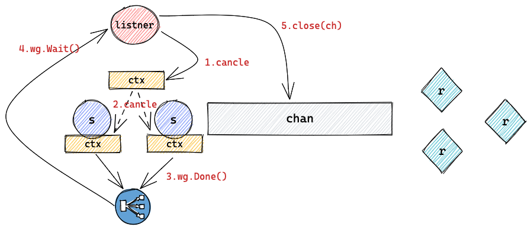

```go
func main() {
    ch := make(chan int, 100)

    ctx, cancel := context.WithCancel(context.TODO())
    ctx1 := context.WithValue(ctx, struct{}{}, struct{}{})
    ctx2 := context.WithValue(ctx, struct{}{}, struct{}{})
    wg := sync.WaitGroup{}
    wg.Add(2)

    //sender
    go func(ctx context.Context) {
        for i := 0; i < 100; i++ {
            select {
            case <-ctx.Done():
                wg.Done()
                return
            case ch <- i:
            }
        }
    }(ctx1)

    //sender
    go func(ctx context.Context) {
        for i := 0; i < 100; i++ {
            select {
            case <-ctx.Done():
                wg.Done()
                return
            case ch <- i:
            }
        }
    }(ctx2)

    //closer
    go func() {
        //满足一定条件以后
        select {
        case <-time.After(2 * time.Second):
        }

        //关闭所有的sender
        cancel()
        wg.Wait()
        close(ch)
    }()

    //revicer
    go func() {
        nums := 0
        for {
            i, ok := <-ch
            if !ok { //如果已经关闭了,则直接中断
                break
            }
            nums++
            fmt.Println(i)
        }
    }()

    select {
    case <-time.After(time.Hour):
    }
}
```

### 7.查看channel容量

```go
len(ch) //查看ch缓冲区内的元素
cap(ch) //查看ch缓冲区的最大容量
```

## 源码总览

源码位置：

```
src/runtime/chan.go
```

### 主结构

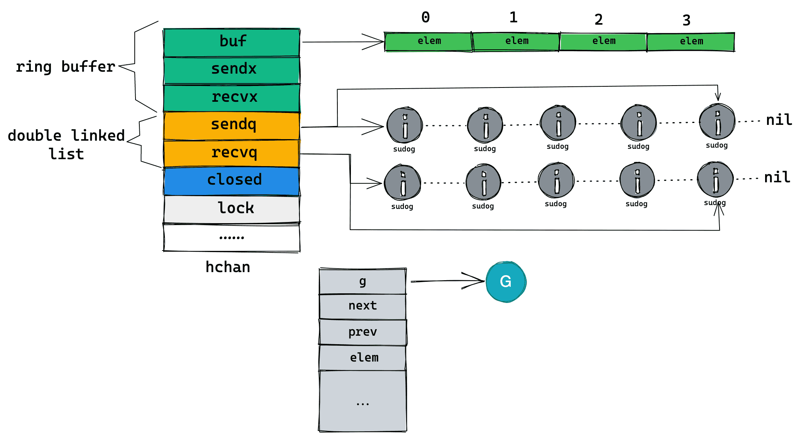

```go
type hchan struct {
    qcount   uint           // 队列中的所有元素个数
    dataqsiz uint           // ring buffer的大小
    buf      unsafe.Pointer // ring buffer 数组实现
    elemsize uint16                    // 元素大小
    closed   uint32                    // 是否关闭
    elemtype *_type // 元素类型
    sendx    uint   // 发送的索引
    recvx    uint   // 接受索引
      recvq    waitq  // recv 等待队列 (<-chane)
      sendq    waitq  // send 等待列表 (chan<-)

    lock mutex //锁
}
```

### buf

buf作为channel的缓冲区，他是一个环形的ringbuffer。

为什么使用ringbuffer来存元素？首先，**我们需要实现一个FIFO的队列**，那么第一反应是链表，新增和删除节点都是O(1)，那么如果使用链表会遇到什么问题呢？

1. send操作时，需要重新分配内存创建一个链表节点。
2. recv操作时，recv后的链表节点需要GC去识别与回收内存。

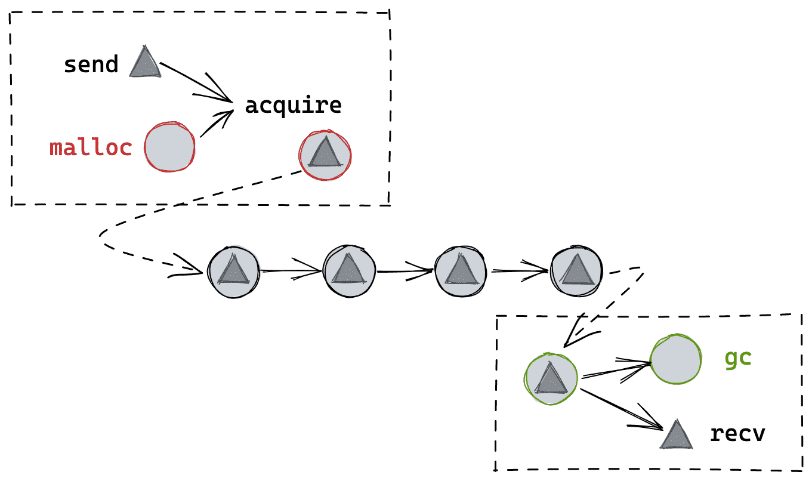

那么如果使用ringbuffer的话，

1. 首先，一次分配内存后，无论send还是recv操作，都不存在内存分配操作，而且减少了GC的压力。
2. 而且，由于数组的大小是固定的，可以直接将ringbuffer和hchan放入连续内存中，提高访问速度。

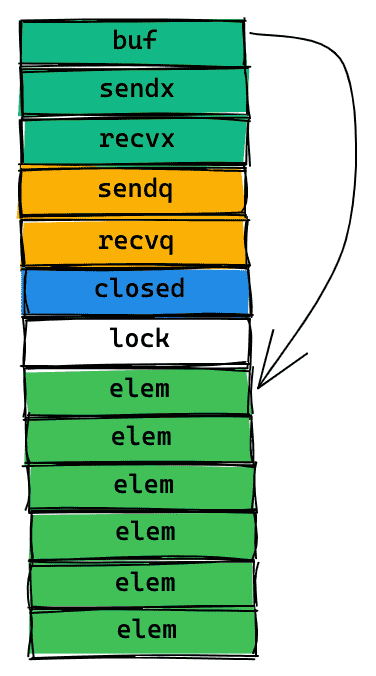

#### ring buf 算法

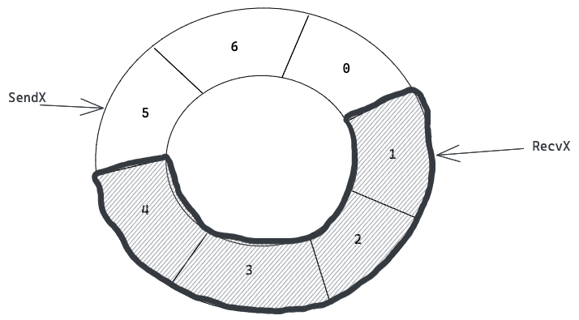


 上图是ringbuffer的简单示意图，其中**recvx指向队尾索引，sendx指向队首前一个索引**

```go
package ring_buffer

//模拟假设只存入int类型
type hchan struct {
    qcount   uint  // total data in the queue
    dataqsiz uint  // size of the circular queue
    buf      []int // points to an array of dataqsiz elements
    sendx    uint  // send index
    recvx    uint  // receive index
}

//创建
func makechan(size int) *hchan {
    c := &hchan{}
    c.dataqsiz = uint(size)
    c.buf = make([]int, size, size)
    return c
}

func full(c *hchan) bool {
    return c.qcount == c.dataqsiz
}

func empty(c *hchan) bool {
    return c.qcount == 0
}

func send(c *hchan, v int) bool {
    //已满
    if c.qcount == c.dataqsiz {
        return false
    }

    c.buf[c.sendx] = v
    c.sendx++
    if c.sendx == c.dataqsiz {
        c.sendx = 0
    }
    c.qcount++
    return true
}

func recv(c *hchan) int {
    if c.qcount == 0 {
        return -1
    }

    v := c.buf[c.recvx]
    c.recvx++
    if c.recvx == c.dataqsiz {
        c.recvx = 0
    }
    c.qcount--
    return v
}
```

### g list

我们知道，不满足发送或者读取条件的协程会被阻塞，这些g会被调度器挂起并且由chan统一管理起来，另外我们知道channel可以在发送方和消费方保证顺序的公平性，这些都是靠waitq结构实现的链表结构。

```go
type waitq struct {
    first *sudog
    last  *sudog
}
```

sudog就是对协程底层结构的包装。

```go
type sudog struct {
    // The following fields are protected by the hchan.lock of the
    // channel this sudog is blocking on. shrinkstack depends on
    // this for sudogs involved in channel ops.
      //下面的字段，由hchan.lock保护
    g *g

    // isSelect indicates g is participating in a select, so
    // g.selectDone must be CAS'd to win the wake-up race.
      // isSelect 标识 g 是否正在参与一个select，因此g.selectDone必须以 CAS 的方式来避免唤醒时的race
    isSelect bool
    next     *sudog
    prev     *sudog
    elem     unsafe.Pointer // data element (may point to stack) 指向要发送或者接受的元素数据，可能指向栈

    // The following fields are never accessed concurrently.
    // For channels, waitlink is only accessed by g.
    // For semaphores, all fields (including the ones above)
    // are only accessed when holding a semaRoot lock.
      //以下字段永远不会被并发访问，

    acquiretime int64
    releasetime int64
    ticket      uint32
    parent      *sudog // semaRoot binary tree
    waitlink    *sudog // g.waiting list or semaRoot
    waittail    *sudog // semaRoot
    c           *hchan // channel 反向索引
}
```

## 创建

```go
//编译器翻译映射
make(chan interface{}, size) ⇒ runtime.makechan(interface{}, size)
make(chan interface{})       ⇒ runtime.makechan(interface{}, 0)
```

```go
func makechan(t *chantype, size int) *hchan {
    //无聊的检查
    ...

    //可恶的GC，我们先不用关心这块逻辑
    // Hchan does not contain pointers interesting for GC when elements stored in buf do not contain pointers.
    // buf points into the same allocation, elemtype is persistent.
    // SudoG's are referenced from their owning thread so they can't be collected.
    // TODO(dvyukov,rlh): Rethink when collector can move allocated objects.
    var c *hchan
    switch {
    case mem == 0:
        // Queue or element size is zero.
        c = (*hchan)(mallocgc(hchanSize, nil, true))
        // Race detector uses this location for synchronization.
        c.buf = c.raceaddr()
    case elem.ptrdata == 0:
        // Elements do not contain pointers.
        // Allocate hchan and buf in one call.
        c = (*hchan)(mallocgc(hchanSize+mem, nil, true))
        c.buf = add(unsafe.Pointer(c), hchanSize)
    default:
        // Elements contain pointers.
        c = new(hchan)
        c.buf = mallocgc(mem, elem, true)
    }

    c.elemsize = uint16(elem.size)
    c.elemtype = elem
    c.dataqsiz = uint(size)
    lockInit(&c.lock, lockRankHchan)

    if debugChan {
        print("makechan: chan=", c, "; elemsize=", elem.size, "; dataqsiz=", size, "\n")
    }
    return c
}
```

抛去和GC相关的检测代码，我们可以简单的总结一下，首先创建一个hchan的结构体，然后给缓冲区分配好对应的内存，且缓冲区和hchan内存是连续的。


## 发送

```go
ch <- v                      ⇒ runtime.chansend1(ch, &v)
```

### 场景拆分

#### 1.buffer not full & has reciver

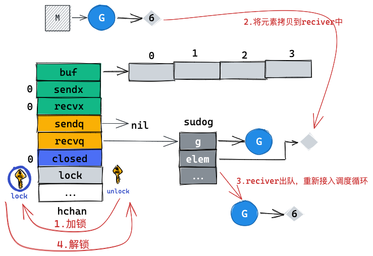

1. 加锁
2. recvq不为空，则直接将元素拷贝到recvq的对头元素中
3. reciver出队，重新进入调度队列中
4. 解锁

这里就不需要死板的先将元素存入缓存然后再拷贝给reciver了，直接将元素拷贝给reciver。

#### 2.buffer not full

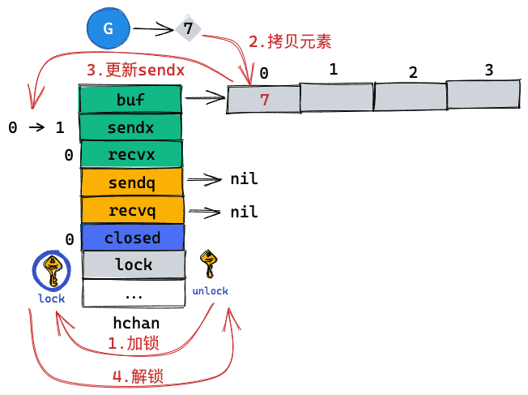

1. 加锁
2. 将元素拷贝至buffer中，并更新sendx
3. 解锁

#### 3.buffer full

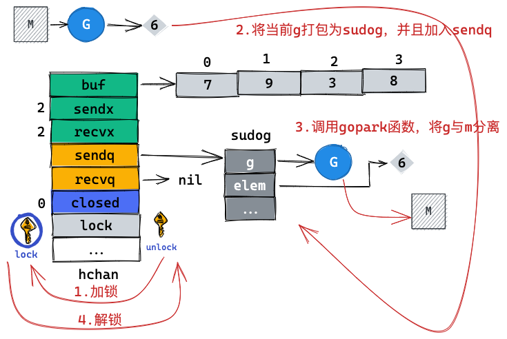

1. 加锁
2. 将当前g和元素打包为sudog，并且加入sendq队列
3. 将当前g与m分离，m继续进入调度，g则挂起等待
4. 解锁

这种情况不再进行自旋了，直接进入休眠。这里可以对比下mutex的实现，先cas操作，失败则先进行自旋，自旋几次还没拿到锁的话，再进行休眠。

所以channel对于阻塞的G是公平的，按照FIFO的顺序进行，而mutex则不然，越新的请求越容易拿到锁。

### 源码

```go
func chansend(c *hchan, ep unsafe.Pointer, block bool, callerpc uintptr) bool {
    //先进行一堆繁琐的检查
    ...

    //加锁
    lock(&c.lock)

    // 不允许向已经 close 的 channel 发送数据 否则panic
    if c.closed != 0 { 
        unlock(&c.lock)
        panic(plainError("send on closed channel"))
    }

    // 1. 找到了阻塞在 channel 上的 reciver，发送
    if sg := c.recvq.dequeue(); sg != nil {
        // Found a waiting receiver. We pass the value we want to send
        // directly to the receiver, bypassing the channel buffer (if any).
        send(c, sg, ep, func() { unlock(&c.lock) }, 3) //其中第四个入参是执行成功的回调函数
        return true
    }

    // 2. 判断 channel 中缓存是否仍然有空间剩余
    if c.qcount < c.dataqsiz {
        // Space is available in the channel buffer. Enqueue the element to send.
        // 有空间剩余，入队 因为是内存操作，可以简单的理解为buf[sendx] = elem
        qp := chanbuf(c, c.sendx)
        if raceenabled {
            racereleaseacquire(qp)
        }
        typedmemmove(c.elemtype, qp, ep)

        //更新游标，并且进行掉头操作
        c.sendx++
        if c.sendx == c.dataqsiz {
            c.sendx = 0
        }
        c.qcount++
        unlock(&c.lock)
        return true
    }

    if !block {
        unlock(&c.lock)
        return false
    }

    // Block on the channel. Some receiver will complete our operation for us.
    // 3. 阻塞在 channel 上，等待接收方接收数据
    gp := getg()
    mysg := acquireSudog()
    mysg.releasetime = 0
    if t0 != 0 {
        mysg.releasetime = -1
    }
    // No stack splits between assigning elem and enqueuing mysg
    // on gp.waiting where copystack can find it.
    mysg.elem = ep
    mysg.waitlink = nil
    mysg.g = gp
    mysg.isSelect = false
    mysg.c = c
    gp.waiting = mysg
    gp.param = nil
    c.sendq.enqueue(mysg)
    // Signal to anyone trying to shrink our stack that we're about
    // to park on a channel. The window between when this G's status
    // changes and when we set gp.activeStackChans is not safe for
    // stack shrinking.
    atomic.Store8(&gp.parkingOnChan, 1)
    gopark(chanparkcommit, unsafe.Pointer(&c.lock), waitReasonChanSend, traceEvGoBlockSend, 2) // 将当前的 g 从调度队列移出
    // 因为调度器在停止当前 g 的时候会记录运行现场，当恢复阻塞的发送操作时候，会从此处继续开始执行
    // Ensure the value being sent is kept alive until the
    // receiver copies it out. The sudog has a pointer to the
    // stack object, but sudogs aren't considered as roots of the
    // stack tracer.
    KeepAlive(ep)

    // someone woke us up.
    // 被唤醒
    if mysg != gp.waiting {
        throw("G waiting list is corrupted")
    }
    gp.waiting = nil
    gp.activeStackChans = false
    closed := !mysg.success
    gp.param = nil
    if mysg.releasetime > 0 {
        blockevent(mysg.releasetime-t0, 2)
    }
    mysg.c = nil
    releaseSudog(mysg)
    if closed {
        // 正常唤醒状态，goroutine 应该包含需要传递的参数，但如果没有唤醒时的参数，且 channel 没有被关闭，则为虚假唤醒
        if c.closed == 0 {
            throw("chansend: spurious wakeup")
        }
        panic(plainError("send on closed channel"))
    }
    return true
}

func send(c *hchan, sg *sudog, ep unsafe.Pointer, unlockf func(), skip int) {
    //竞争检测
    ...

    if sg.elem != nil {
        sendDirect(c.elemtype, sg, ep)
        sg.elem = nil
    }
    gp := sg.g
    unlockf()
    gp.param = unsafe.Pointer(sg)
    sg.success = true
    if sg.releasetime != 0 {
        sg.releasetime = cputicks()
    }
    // 放入调度队列等待被后续调度
    // 第二个参数用于 trace 追踪 ip 寄存器的位置，go runtime 又不希望暴露太多内部的调用，因此记录需要跳过多少 ip
    goready(gp, skip+1)
}
```

可以看到，在发送操作时，

1. 会先检测等待队列中是否为空，如果不为空则直接将元素拷贝到reciver中，并且唤醒reciver（等待队列不为空则说明buf一定为空）
2. 检测buf是否存在且未满，则将元素加入缓存 & 更新游标
3. 否则进入休眠，调用gopark函数，将G与M分离，M重新进入调度器寻找P要G

## 接受

```go
v := <- ch                   ⇒ runtime.chanrecv1(ch, &v)
v, ok := <- ch               ⇒ ok := runtime.chanrecv2(ch, &v)
```

### 场景拆分

#### 1.buf not empty

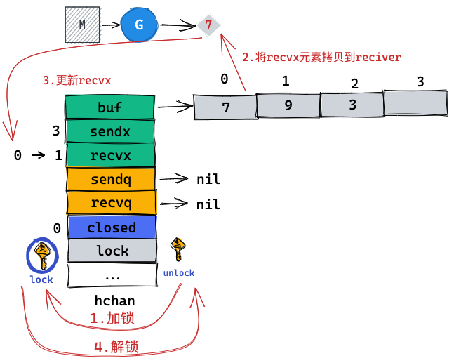

1. 加锁
2. 拷贝buf[recvx]到reciver
3. 更新recvx
4. 解锁

#### 2.sendq not empty

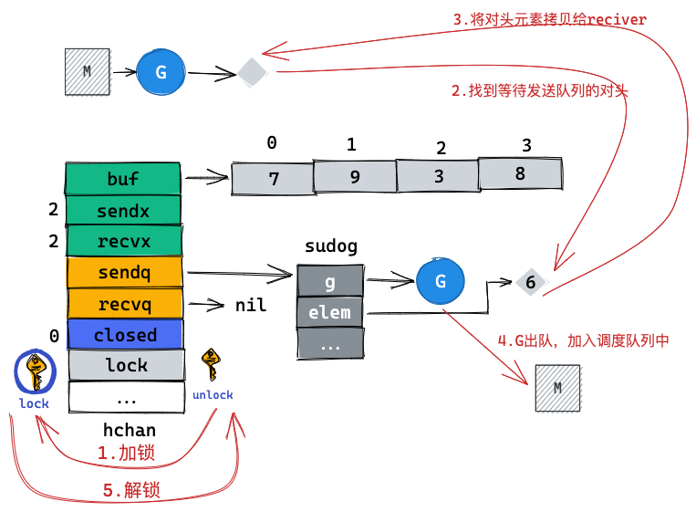

1. 加锁
2. sendq队头是否为空，不为空则直接将sender的数据拷贝给reciver，并且唤醒sender
3. 解锁

**这里不首先接收buf中的元素，而是直接去接收了等待发送队列中的元素，这么做是为了优先将阻塞的G接触阻塞，毕竟buf中元素的sender此时都处于非阻塞状态。**

#### 3.sendq empty & buf empty

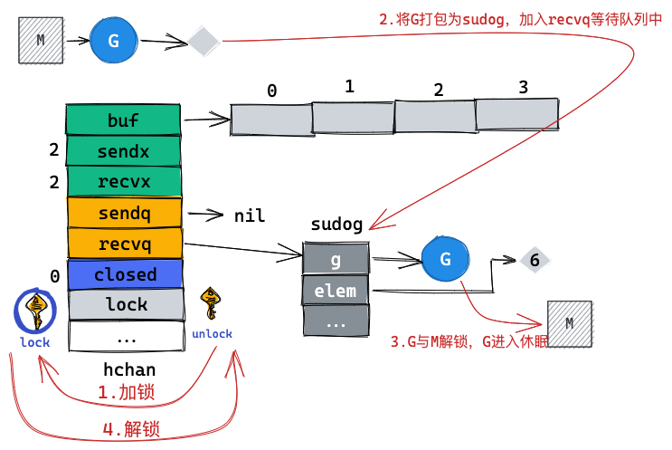

1. 加锁
2. 将G打包为sudog，加入到等待队列队尾
3. G与M解锁，G调用gopark函数进入休眠
4. 解锁

### 源码

```go
func chanrecv(c *hchan, ep unsafe.Pointer, block bool) (selected, received bool) {
    //复杂枯燥的检查
    ...

    lock(&c.lock)
    // 1. channel 已经 close，且 channel 中没有数据，则直接返回
    if c.closed != 0 && c.qcount == 0 {
        if raceenabled {
            raceacquire(c.raceaddr())
        }
        unlock(&c.lock)
        if ep != nil {
            typedmemclr(c.elemtype, ep)
        }
        return true, false
    }
    // 2. 找到发送方，直接接收
    if sg := c.sendq.dequeue(); sg != nil {
        // Found a waiting sender. If buffer is size 0, receive value
        // directly from sender. Otherwise, receive from head of queue
        // and add sender's value to the tail of the queue (both map to
        // the same buffer slot because the queue is full).
        recv(c, sg, ep, func() { unlock(&c.lock) }, 3)
        return true, true
    }

    // 3. channel 的 buf 不空
    if c.qcount > 0 {
        // Receive directly from queue
        qp := chanbuf(c, c.recvx)
        if raceenabled {
            racereleaseacquire(qp)
        }
        if ep != nil {
            typedmemmove(c.elemtype, ep, qp)
        }
        typedmemclr(c.elemtype, qp)
        c.recvx++
        if c.recvx == c.dataqsiz {
            c.recvx = 0
        }
        c.qcount--
        unlock(&c.lock)
        return true, true
    }

    if !block {
        unlock(&c.lock)
        return false, false
    }

    // no sender available: block on this channel.
    // 4. 没有更多的发送方，阻塞 channel
    gp := getg()
    mysg := acquireSudog()
    mysg.releasetime = 0
    if t0 != 0 {
        mysg.releasetime = -1
    }
    // No stack splits between assigning elem and enqueuing mysg
    // on gp.waiting where copystack can find it.
    mysg.elem = ep
    mysg.waitlink = nil
    gp.waiting = mysg
    mysg.g = gp
    mysg.isSelect = false
    mysg.c = c
    gp.param = nil
    c.recvq.enqueue(mysg)
    // Signal to anyone trying to shrink our stack that we're about
    // to park on a channel. The window between when this G's status
    // changes and when we set gp.activeStackChans is not safe for
    // stack shrinking.
    atomic.Store8(&gp.parkingOnChan, 1)
    gopark(chanparkcommit, unsafe.Pointer(&c.lock), waitReasonChanReceive, traceEvGoBlockRecv, 2)

    // someone woke us up
    // 唤醒
    if mysg != gp.waiting {
        throw("G waiting list is corrupted")
    }
    gp.waiting = nil
    gp.activeStackChans = false
    if mysg.releasetime > 0 {
        blockevent(mysg.releasetime-t0, 2)
    }
    success := mysg.success
    gp.param = nil
    mysg.c = nil
    releaseSudog(mysg)
    return true, success
}
```

可以看到，在接收操作时，

1. 首先看等待发送队列是否为空，如果不为空则优先将数据拷贝给阻塞的sender（减少G的阻塞时间）
2. 再看buf是否为空，不为空则从buf中接收
3. 如果都为空，则将当前G打包为sudog加入接收等待队列中

## 关闭

```
close(ch)                    ⇒ runtime.closechan(ch)
```

### 场景拆分

**根据send和recive的行为，我们知道不会存在sendq和recvq同时不为空的情况**

#### 1.recvq not empty


1. 加锁
2. 更改close状态
3. 将recvq中的sudog加入到glist中
4. 解锁
5. 依次将glist中的sudog唤醒，每个唤醒的G会返回元素零值

之所以先将recvq迁移到glist之后就进行解锁，是为了减少加锁的临界区

#### 2.sendq not empty

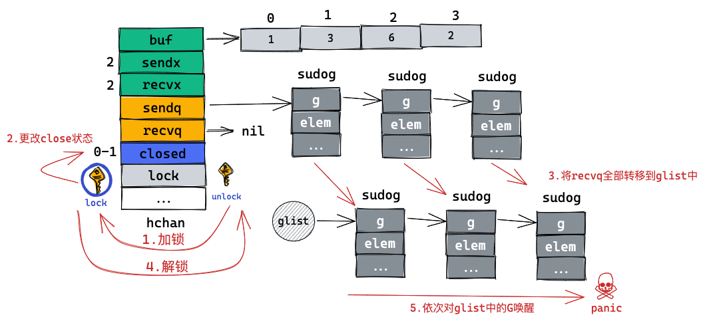

1. 加锁
2. 更改close状态
3. 将sendq中的sudog加入到glist中
4. 解锁
5. 依次将glist中的sudog唤醒，每个唤醒的G会直接报panic

### 源码

```go
func closechan(c *hchan) {
    //关闭空chan会panic
    if c == nil {
        panic(plainError("close of nil channel"))
    }

    //加锁
    lock(&c.lock)

    //多次close panic
    if c.closed != 0 {
        unlock(&c.lock)
        panic(plainError("close of closed channel"))
    }

    c.closed = 1

    var glist gList

    // release all readers
    // 释放所有的读者
    for {
        sg := c.recvq.dequeue()
        if sg == nil {
            break
        }
        if sg.elem != nil {
            typedmemclr(c.elemtype, sg.elem)
            sg.elem = nil
        }
        if sg.releasetime != 0 {
            sg.releasetime = cputicks()
        }
        gp := sg.g
        gp.param = unsafe.Pointer(sg)
        sg.success = false
        if raceenabled {
            raceacquireg(gp, c.raceaddr())
        }
        glist.push(gp)
    }

    // release all writers (they will panic)
    // 释放所有的写者 (panic)
    for {
        sg := c.sendq.dequeue()
        if sg == nil {
            break
        }
        sg.elem = nil
        if sg.releasetime != 0 {
            sg.releasetime = cputicks()
        }
        gp := sg.g
        gp.param = unsafe.Pointer(sg)
        sg.success = false
        if raceenabled {
            raceacquireg(gp, c.raceaddr())
        }
        glist.push(gp)
    }
    unlock(&c.lock)

    // Ready all Gs now that we've dropped the channel lock.
    // 就绪所有的 G 即可释放 channel 锁
    for !glist.empty() {
        gp := glist.pop()
        gp.schedlink = 0
        goready(gp, 3)
    }
}
```

我们再回头看看close后，sender和reciver被唤醒之后的代码

```go
//sender
    ....
    gopark(chanparkcommit, unsafe.Pointer(&c.lock), waitReasonChanSend, traceEvGoBlockSend, 2) // 将当前的 g 从调度队列移出
    // 因为调度器在停止当前 g 的时候会记录运行现场，当恢复阻塞的发送操作时候，会从此处继续开始执行
    // Ensure the value being sent is kept alive until the
    // receiver copies it out. The sudog has a pointer to the
    // stack object, but sudogs aren't considered as roots of the
    // stack tracer.
    KeepAlive(ep)

    // someone woke us up.
    // 被唤醒
    if mysg != gp.waiting {
        throw("G waiting list is corrupted")
    }
    gp.waiting = nil
    gp.activeStackChans = false
    closed := !mysg.success
    gp.param = nil
    if mysg.releasetime > 0 {
        blockevent(mysg.releasetime-t0, 2)
    }
    mysg.c = nil
    releaseSudog(mysg)
    if closed {
        // 正常唤醒状态，goroutine 应该包含需要传递的参数，但如果没有唤醒时的参数，且 channel 没有被关闭，则为虚假唤醒
        if c.closed == 0 {
            throw("chansend: spurious wakeup")
        }
        panic(plainError("send on closed channel")) //直接报panic
    }
    return true
}

//reciver
    ...
    gopark(chanparkcommit, unsafe.Pointer(&c.lock), waitReasonChanReceive, traceEvGoBlockRecv, 2)

    // someone woke us up
    // 唤醒
    if mysg != gp.waiting {
        throw("G waiting list is corrupted")
    }
    gp.waiting = nil
    gp.activeStackChans = false
    if mysg.releasetime > 0 {
        blockevent(mysg.releasetime-t0, 2)
    }
    success := mysg.success
    gp.param = nil
    mysg.c = nil
    releaseSudog(mysg)
    return true, success
}
```

# 扩展

- 如何实现一个无限长度的channel

- 如何实现一个lock free的channel （乐观锁）

- 实现一个元素不定长的ring buffer
