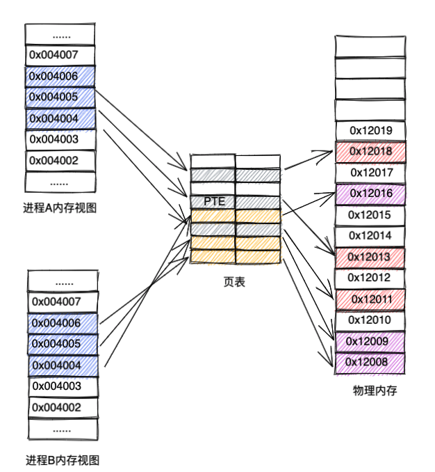
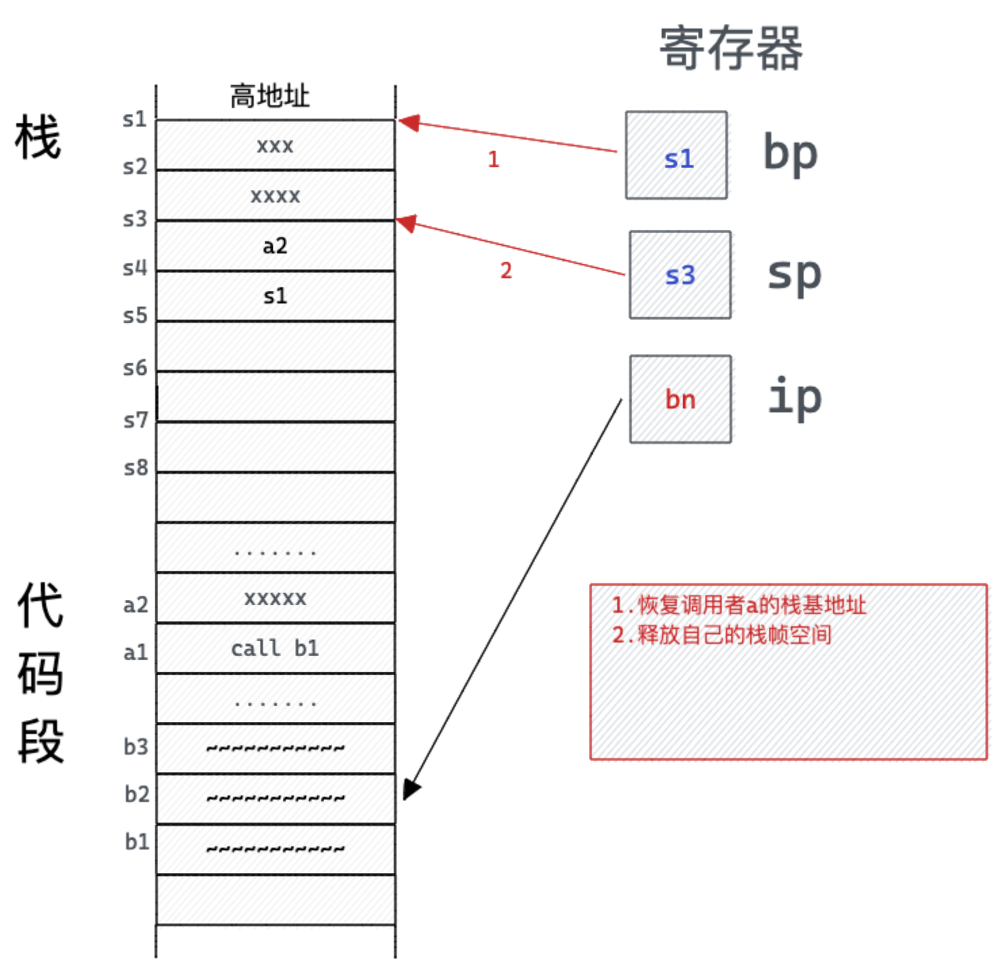

---

---

> 写在开头：
> 
> 本文仅科普性质分享，旨在为大家构建一个go scheduler发展大纲性的印象，会丢失很多代码以及设计细节，对于这方面的内容还需要读者自己去深挖代码补充完整:P

# 一、计算机发展简史

## 1. 远古时代

>  一切要从1946年说起，当世界第一台计算机问世时，世界拥有了第一台计算机。（废话文学）


当时的埃尼阿克(eniac)是为了计算炮弹轨迹而发明的，将你要计算的程序打到纸带上，接通电源，等待执行结果。期间不能暂停，也不能做其他任何事情。它上面没有操作系统，更别提进程、线程和协程了。

## 2. 单进程时代


后来，现代化的计算机有了操作系统，操作系统上可以安装多个应用，每个应用程序都包装为一个进程。它主要包括两部分：

1. 私有数据
2. 指令流

但是，当时的操作系统在一段时间只能运行一个进程，直到这个进程运行完，才能运行下一个进程，这个时期可以称为**单进程时代——串行时代**。


和ENIAC相比，单进程时代运行速度已有了几万倍的提度，但依然是太慢了，比如进程要读数据阻塞了，CPU就在那里浪费着，程序员们就想了，不能浪费啊，**怎么才能充分的利用CPU呢？** 如果在cpu等待时，切换到另外的进程进行执行，CPU的效率就提高上来了。


## 3. 多进程时代

> 从这个节点开始，人类在追求高并发的道路上一去不复返了

后来操作系统就具有了**最早的并发能力：多进程并发**，当一个进程阻塞的时候，切换到另外等待执行的进程，这样就能尽量把CPU利用起来，CPU就不浪费了。

 

给用户造成的假象就是，A B C三个进程同时在运行着。然而，为了实现这个目标，操作系统变得格外的复杂。

实现多进程并发首先我们需要保障的有两点：

1. 实现进程间数据**完全隔离**
2. 实现进程间指令流的**安全切换**

具体如何实现的呢：

### 3.1 虚拟内存

操作系统引入了虚拟内存，来做到进程间数据的隔离。

进程启动时，操作系统会为进程分配一块虚拟内存空间，每个进程拿到的 **虚拟内存空间布局是相同的**，**且大小等于机器实际物理内存大小**，但是实际上这块连续的内存空间对应机器内存中是一块块的内存碎片，这个假象是由虚拟内存技术实现的。



进程需要访问某个地址时，例如0x004005，都会先去查询页表，定位到对应的PTE（页表项），PTE记录着对应的真实的物理内存地址，继而再对这个真实地址进行访问。

每个进程都会有相同的页表，且内存结构也相同，对于每个进程来说都认为自己占用了机器全部的内存，操作系统在做虚拟内存映射时保证一个物理地址只会分配给一个进程（共享内存区域 & 内核区域除外），这样就**保证了进程间的内存数据是隔离的**。

### 3.2 进程内存结构

32位机器：

  

从低位向高位看：

- 代码段总是从地址0x400000开始的，存储着用户程序的代码，字面量等
- 然后是数据段，存储用户程序的一些宏，全局变量，代码等
- 之后是堆，程序运行过程中产生的变量等都会存放在堆中，且堆空间向高位地址延伸
- 在用户栈和堆之间存在一块为共享库分配的内存空间，这里存储着例如.so动态链接文件等
- 再之后是用户栈，函数调用的入参，临时变量，以及调用信息等存放于此
- 内存最高位则是内核内存空间，用户栈是从2^48-1处开始向下延伸的，这段空间固定映射到一部分连续的物理地址上

所以，每个进程的程序指令流都会存在该进程的内存空间中，保证了进程的指令流完全隔离

可以看到，当前进程的指令流是存在于本进程的内存中，所以，在切换进程之前，我们把当前运行到的pc位置做保存现场，再次切换到本进程时继续已之前的pc处开始执行即可。

### 3.3 进程控制块 PCB

内核为每个进程维护了一个pcb的结构，主要用于记录进程状态，在Linux中，PCB结构为task_struct；

task_struct是Linux内核的一种数据结构，它会被装载到RAM里并且包含进程的信息，每个进程都把它的信息放在task_struct这个数据结构里。那么这个结构体里存了哪些数据呢：

**1.进程状态：是调度和兑换的依据**

| linux进程的状态           |           |
| -------------------- | --------- |
| 内核表示                 | 含义        |
| TASK_RUNNING         | 可运行       |
| TASK_INTERRUPTIBLE   | 可中断的等待状态  |
| TASK_UNINTERRUPTIBLE | 不可中断的等待状态 |
| TASK_ZOMBIE          | 僵死        |
| TASK_STOPPED         | 暂停        |
| TASK_SWAPPING        | 换入/换出     |

**2.标识符：描述本进程的唯一标识符，用来区别其它进程**

每个进程都有一个唯一的标识符，内核通过这个标识符来识别不同的进程，同时，进程标识符PID也是内核提供给用户程序的接口，用户程序通过PID对进程发号施令。PID是32位的无符号整数，它被顺序编号：新创建进程的PID通常是前一个进程的PID加1。然而，为了与16位硬件平台的传统Linux系统保持兼容，在Linux上允许的最大PID号是32767，当内核在系统中创建第32768个进程时，就必须重新开始使用已闲置的PID号。

| 各种标识符       |                    |
| ----------- | ------------------ |
| 域名          | 含义                 |
| pid         | 进程标识符              |
| ppid        | 父进程                |
| uid、gid     | 用户标识符、组标识符         |
| euid、egid   | 有效用户标识符、有效组标识符     |
| suid、sgid   | 备份用户标识符、备份组标识符     |
| fsuid、fsgid | 文件系统用户标识符、文件系统组标识符 |

**3.进程调度信息**

调度程序利用这部分信息决定系统中哪个进程应该优先运行，并结合进程的状态信息保证系统运转的公平和高效。这一部分信息通常包括进程的类别（普通进程还是实时进程）、进程的优先级（priority）等等

| 进程调度信息       |       |
| ------------ | ----- |
| 域名           | 含义    |
| need_resched | 调度标志  |
| nice         | 静态优先级 |
| counter      | 动态优先级 |
| policy       | 调度策略  |
| rt_priority  | 实时优先级 |

**4.程序计数器：程序中即将被执行的下一条指令的地址**

**5.内存指针：包括程序代码和进程相关数据指针，还有和其他进程共享的内存块的指针**

**6.与处理器相关的上下文数据：程序执行时处理器的寄存器中的数据**

**7.I/O状态信息：包括显示的I/O请求，分配给进程的I/O设备和被进程使用的文件列表**

**8.记账信息：可以包括处理器时间总和，使用的时钟数总和、时间限制、记账号等**

那么我们看到，内核为每个进程维护的PCB中，保存了每个进程当前的程序计数器，每当本进程被唤醒执行时，会将当前进程PCB信息载入寄存器中，并会将当前的程序计数器放到CS/IP上继续执行，这也就保证了 **进程指令流的安全切换** 。

### 3.4 进程的问题

#### 1.资源占用

那么，每个并发任务创建一个新的进程来应对，是否就是解决并发的银弹呢？并不是，进程太重了。。。

每个进程所包含的数据，除了用户态应用程序的数据之外，还会包含很多操作系统的数据，也就是说进程的内存空间中包含了本进程运行需要的所有家当，举个最简单的例子：页表

> 32位机器，能寻址的内存空间为2^32B = 2^22KB = 2^12MB = 4GB。页表大小是4K，那么就会有2^32B / 2^12B = 2^20个PTE，如果每个PTE大小为4B，那么整个页表大小为2^20 * 4B = 4MB!

每个进程都要搞这么大的内存去存一个页表，这消耗太大了。如果涉及到64位系统，如果只有一级页表，那么内存占用更是巨大，就算引入了多级页表，倒排页表等技术，页表仍是一个非常大的内存消耗。

#### 2.不能利用多核

当代计算机，硬件有了很大的进步，出现了多核，多cpu的计算机配置。我们简单的拆解下：

 

这个是一个多CPU & 多核的机器图解，可以看到每个CPU有两个核，核即是计算单元，且每个CPU都有自己的高速缓存。那么针对进程，每个进程都是独占机器资源，我们可以得到进程被唤醒时运行的情况：

 

可以看到，每个cpu有一个核是空闲的，这就浪费了多核的优势了

#### 3.进程切换消耗过大

我们知道，进程分为内核态进程程和用户态进程，用户态进程需要绑定内核态进程，CPU并不能感知用户态进程的存在，它只知道它在运行1个进程，这个进程实际是内核态进程。

一个进程的内存空间分为用户空间和内核空间，相应的，一个进程也分为两种状态，内核态和用户态，对于用户代码逻辑，是在用户态执行的，对于内核的逻辑，例如系统调用，进程调度等，都需要将进程提升进入内核态进行执行。


且内核态和用户态之间内存隔离，用户态到内存态切换开销是非常大的，但是它的开销大在那里呢？简单点来说有下面几点

- 保留用户态现场（上下文、寄存器、用户栈等）
- 复制用户态参数，用户栈切到内核栈，进入内核态
- 额外的检查（因为内核代码对用户不信任）
- 执行内核态代码
  - 线程上下文切换: PC, SP 等寄存器，栈，线程相关的一些局部变量，还涉及一些 cache miss 的情况；
- 复制内核态代码执行结果，回到用户态
- 恢复用户态现场（上下文、寄存器、用户栈等）


这还不算上内核在切换pcb时对寄存器和高速缓存的修改耗时，简单来说，进程的切换需要进行内核态和用户态的切换，这个消耗是十分巨大的。

那么，针对上述的问题，我们有没有办法进行改进呢？

## 4. 线程时代

我们知道，一个进程有两部分组成，数据 & 指令，那么如果多个进程间共享一套数据，但是拥有多个指令流是不是就能解决上述的两个问题呢，于是线程就诞生了。一个进程可以拥有多个线程，每个线程共享一套数据，但是保留各自独立的指令流。


### 拓展-TCMalloc(Thread-Caching Malloc)

 那么，聪明的你肯定会问，一个进程拥有多个线程，且这些线程共享一套内存空间，那么在对内存操作时岂不是锁竞争很严重？

对，所以针对这类锁竞争，操作系统使用了线程本地缓存技术来降低锁的竞争，其核心策略就是降低锁的力度，提前为每个线程分配好一段free内存，当线程内需要分配的内存不是特别大时，可以直接无锁的在本地缓存中进行分配，这种方式十分有效！


但是，这么做是不是说明我们找到银弹了呢，其实不是的，线程只解决了前两个问题，即：

1. 降低了一个调度单元的内存占用
2. 能发挥多核的性能

那么如何解决第三个问题呢？

## 5. 协程时代

我们知道，在多个线程 & 进程间进行调度，需要切换到内核态进行，这无疑是消耗巨大的，那么如果我们对逻辑流调度时，绕开操作系统内核，直接在用户态进行，是否就能解决这个问题呢？所以有人提出了用户态线程的概念，即co-routine（协程），协作式线程。

协程的调度和线程的调度是由区别的，线程调度是抢占式的，协程调度是协作式的，一个协程让出cpu后，才执行下一个协程。

协程和线程有3种映射关系：

- N:1，N个协程绑定1个线程，优点就是**协程在用户态线程即完成切换，不会陷入到内核态，这种切换非常的轻量快速**。但也有很大的缺点，1个进程的所有协程都绑定在1个线程上，**一是某个程序用不了硬件的多核加速能力**，**二是一旦某协程阻塞，造成线程阻塞**，本进程的其他协程都无法执行了，根本就没有并发的能力了。
  
  - 

- 1:1，1个协程绑定1个线程，这种最容易实现。协程的调度都由内核完成了，不存在N:1缺点，但有一个缺点是协程的创建、删除和切换的代价都由内核完成，这跟线程差别不大。
  
  - 

- M:N，M个协程绑定N个线程，是N:1和1:1类型的结合，克服了以上2种模型的缺点，但实现起来最为复杂。
  
  - 

至此，对于协程和线程以及进程我们介绍到这里，相关的更多知识可以参考CSAPP这本书，讲的不错。

下面，我们把视线拉回到Golang上来。

# 二、Goroutine

**Go语言的诞生就是为了支持高并发**，目前有两类通用的高并发模型，

1. 共享内存型 Shared Memory
   1. 线程 Threads
   2. 锁 Locks
   3. 互斥量 Mutexes
2. 消息传递型 （CSP和Actor模型）
   1. 进程 Process
   2. 消息 Message
   3. 不共享数据（状态）No Shared Data

[鉴于Occam和Erlang都选用了CSP](https://golang.org/doc/faq)(来自Go FAQ)，并且效果不错，Go也选了CSP，这也是为什么go提倡说，不用使用共享内存来通信，要是有通信来共享内存。

就像前面说的多线程编程太不友好了，**Go为了提供更容易使用的并发方法，使用了goroutine和channel**。goroutine来自协程的概念，让一组可复用的函数运行在一组线程之上，即使有协程阻塞，该线程的其他协程也可以被`runtime`调度，转移到其他可运行的线程上。最关键的是，程序员看不到这些底层的细节，这就降低了编程的难度，提供了更容易的并发。

Go中，**协程被称为goroutine**（Rob Pike说goroutine不是协程，因为他们并不完全相同），它**非常轻量，一个goroutine只占几KB**，并且这几KB就足够goroutine运行完，这就能在有限的内存空间内支持大量goroutine，支持了更多的并发。虽然一个goroutine的栈只占几KB，但实际是**可伸缩**的，如果需要更多内容，`runtime`会自动为goroutine分配。

## 协程调度 VS 线程调度 性能差别

线程切换大概在**几微秒**级别，协程切换大概在**百 ns** 级别。相差**30倍**左右。

线程切换过程:

1. 进入系统调用
2. 调度器本身代码执行
3. 线程上下文切换: PC, SP 等寄存器，栈，线程相关的一些局部变量，还涉及一些 cache miss 的情况；
4. 退出系统调用

协程切换不需要进入和退出系统调用, 在进行上下文切换时也更轻量, 只需要切换几个寄存器, 协程 `runtime.g` 结构只有 40 多个字段, 而线程的 task struct 有大概 300 个字段.

更多内容可以参考：

[进程/线程上下文切换会用掉你多少CPU？](https://zhuanlan.zhihu.com/p/79772089)

[协程究竟比线程能省多少开销？](https://zhuanlan.zhihu.com/p/80037638)

# 三、调度器 Scheduler

**调度器的任务是在用户态完成goroutine的调度，而调度器的实现好坏，对并发实际有很大的影响，并且Go的调度器就是M:N类型的，实现起来也是最复杂**。

## 1. 单线程调度器 · [0.x](https://github.com/golang/go/blob/96824000ed89d13665f6f24ddc10b3bf812e7f47/src/runtime/proc.c)

**调度时机：当前G发生系统调用，当前G执行完成** 

0.x 版本调度器只包含表示 Goroutine 的 G 和表示线程的 M 两种结构，全局也只有一个线程。我们可以在 [clean up scheduler](https://github.com/golang/go/commit/96824000ed89d13665f6f24ddc10b3bf812e7f47) 提交中找到单线程调度器的源代码，在这时 Go 语言的调度器还是由 C 语言实现的，调度函数 [`runtime.scheduler:9682400`](https://draveness.me/golang/tree/runtime.scheduler:9682400) 也只包含 40 多行代码 。


该函数会遵循如下的过程调度 Goroutine：

1. 获取调度器的全局锁；
2. 调用 [`runtime.gosave:9682400`](https://draveness.me/golang/tree/runtime.gosave:9682400) 保存栈寄存器和程序计数器；
3. 调用 [`runtime.nextgandunlock:9682400`](https://draveness.me/golang/tree/runtime.nextgandunlock:9682400) 获取下一个需要运行的 Goroutine 并解锁调度器；
4. 修改全局线程 `m` 上要执行的 Goroutine；
5. 调用 [`runtime.gogo:9682400`](https://draveness.me/golang/tree/runtime.gogo:9682400) 函数运行最新的 Goroutine；

虽然这个单线程调度器的唯一优点就是**能运行**，但是这次提交已经包含了 G 和 M 两个重要的数据结构，也建立了 Go 语言调度器的框架。

## 2. 多线程调度器 · [1.0](https://github.com/golang/go/blob/go1.0.1/src/pkg/runtime/proc.c)

**调度时机：当前G发生系统调用，当前G执行完成** 

Go 语言在 1.0 版本正式发布时就支持了多线程的调度器，与上一个版本几乎不可用的调度器相比，Go 语言团队在这一阶段实现了从不可用到可用的跨越。我们可以在 [`pkg/runtime/proc.c`](https://github.com/golang/go/blob/go1.0.1/src/pkg/runtime/proc.c) 文件中找到 1.0.1 版本的调度器，多线程版本的调度函数 [`runtime.schedule:go1.0.1`](https://draveness.me/golang/tree/runtime.schedule:go1.0.1) 包含 70 多行代码。


整体的逻辑与单线程调度器没有太多区别，因为我们的程序中可能同时存在多个活跃线程，所以多线程调度器引入了 `GOMAXPROCS` 变量帮助我们灵活控制程序中的最大处理器数，即活跃线程数。

### 1. scheduler角色介绍


1. G：代表一个协程 Goroutine
2. M：代表一个线程 Thread
3. Sched：调度器全局结构

#### G


```c
struct  G
{
  // ...
  Gobuf sched; // SP + PC寄存器
  G* alllink; // 所有的G
  int16 status;
  int32 goid; // 自增ID
  G* schedlink; // 全局可复用G队列（已经死掉那些）
  // ...
};
```

#### M


```c
struct  M
{
  G* g0; // g0 w interrupt stack - must not move
  G* curg; // 当前运行的goroutine
  G* lastg; // 最后一个运行的goroutine
  Gobuf sched; // SP + PC
  // ...
  Note havenextg;
  G* nextg; // 下一个要运行的G
  M* schedlink; // 全局空闲的M（M好像不会死！）
  // ...
};
```

可以看到，m常驻一个g0，这个g0的理解可以对标进程中的内核态进程，他与curg有独立的栈和pc，主要用来进行和用户代码无关的逻辑：

1. 负责调度
2. 创建新的m
3. 创建新的g
4. 。。。

而curg只有go func()代码相关的数据，和g0互相隔离。

#### Sched


```c
struct Sched {
    Lock;

    G *gfree;    // available g's (status == Gdead) 全局可用空闲g
    int32 goidgen; //g id发号器

    G *ghead;    // g's waiting to run 全局可运行g列表的头
    G *gtail; //全局可运行g列表的尾
    int32 gwait;    // number of g's waiting to run 全局等待运行g的个数
    int32 gcount;    // number of g's that are alive 全局活跃的g的个数
    int32 grunning;    // number of g's running on cpu or in syscall 全局正在运行的g的个数

    M *mhead;    // m's waiting for work 全局等待运行m队列头
    int32 mwait;    // number of m's waiting for work 全局等待运行m个数
    int32 mcount;    // number of m's that have been created 全局m个数

    volatile uint32 atomic;    // atomic scheduling word (see below)

    int32 profilehz;    // cpu profiling rate

    bool init;  // running initialization
    bool lockmain;  // init called runtime.LockOSThread

    Note    stopped;    // one g can set waitstop and wait here for m's to stop
};
```

1. 维护了一个全局空闲g列表，由g.schedlink串联

2. 维护了一个全局g列表，由g.alllink串联

3. 维护了一个全局等待运行g列表，由g.schedlink串联

4. #### 维护了一个全局m列表， 由m.alllink串联

5. 维护了一个等待运行m列表，由m.schedlink串联

以上，所有g和m全局收敛，所有对结构的访问需要进行加锁操作

### 2. 整体一张图


### 3. 整体初始化


可以看到，整个scheduler的生命周期贯穿了整个go程序，在程序启动之初，

1. m0由汇编代码创建
2. 紧接着，调用了schedinit初始化调度器
3. 然后，汇编又创建了g0，并且将g0加入了全局队列
4. 调用mstart，启动m0以及g0，这时的m0的g0中的pc指针指向runtime.main，而runtime.main会调用main.main
5. 整个代码run起来

#### 3.1 调度器初始化


```c
// The bootstrap sequence is:
//
//    call osinit
//    call schedinit
//    make & queue new G
//    call runtime.mstart
//
// The new G calls runtime.main.
void
runtime.schedinit(void)
{
    int32 n;
    byte *p;

  //初始化m0
    m->nomemprof++;
    runtime.mallocinit();
    mcommoninit(m);

  ...

  //处理参数
    runtime.goargs();
    runtime.goenvs();

  //初始化m上限
    runtime.gomaxprocs = 1;
    p = runtime.getenv("GOMAXPROCS");
    if(p != nil && (n = runtime.atoi(p)) != 0) {
        if(n > maxgomaxprocs)
            n = maxgomaxprocs;
        runtime.gomaxprocs = n;
    }

  ...

  //更新全局数据
    canaddmcpu();    // mcpu++ to account for bootstrap m
    m->helpgc = 1;    // flag to tell schedule() to mcpu--
    runtime.sched.grunning++;

    mstats.enablegc = 1;
    m->nomemprof--;
}
```

#### 3.2 初始化m

```c
static void
mcommoninit(M *m)
{
    m->id = runtime.sched.mcount++;
    m->fastrand = 0x49f6428aUL + m->id + runtime.cputicks();
    m->stackalloc = runtime.malloc(sizeof(*m->stackalloc));
    runtime.FixAlloc_Init(m->stackalloc, FixedStack, runtime.SysAlloc, nil, nil);

  //初始化mcache
    if(m->mcache == nil)
        m->mcache = runtime.allocmcache();

    runtime.callers(1, m->createstack, nelem(m->createstack));

  //加入全局列表
    // Add to runtime.allm so garbage collector doesn't free m
    // when it is just in a register or thread-local storage.
    m->alllink = runtime.allm;
    // runtime.NumCgoCall() iterates over allm w/o schedlock,
    // so we need to publish it safely.
    runtime.atomicstorep(&runtime.allm, m);
}
```

这里，mcache管理线程在本地的缓存的mspan，这里面存储的内容和g相关性非常强，例如g的入参，g执行过程中产生的分配在heap上的变量等。**mcache管理的这部分内存，其实就是TCMalloc技术中分配的内存。**

#### 3.3 启动m0


1. 在初始化完成后，紧接着汇编代码创建了g0，并将g0加入了全局g队列
2. 紧接着调用mstart，mstart接着调用调度函数schedule()，为当前m寻找一个可用的g
3. 因为当前队列中只有g0和m0，所以此时就是m0和g0会关联起来，并且开始运行
4. 此时g0的pc指针指向的是runtime.main，而runtime.main又调用了main.main，这样go程序就运行起来了。

```c
// Called to start an M.
void
runtime.mstart(void)
{
    if(g != m->g0)
        runtime.throw("bad runtime.mstart");

    // Record top of stack for use by mcall.
    // Once we call schedule we're never coming back,
    // so other calls can reuse this stack space.
    runtime.gosave(&m->g0->sched);
    m->g0->sched.pc = (void*)-1;  // make sure it is never used
    runtime.asminit();
    runtime.minit();

    // Install signal handlers; after minit so that minit can
    // prepare the thread to be able to handle the signals.
    if(m == &runtime.m0)
        runtime.initsig();

    schedule(nil);
}
```

#### 3.4 调度主流程


1. 首先，对全局加锁
2. 入参如果为空，说明是启动过程中的调用，直接去寻找g并且全局解锁，这个时候寻找到的一定是g0
3. 如果入参不为空，则说明是在m正在执行g的过程中进行了调度流程，需要对当前的g进行状态转换&暂存，此时的g可能是：
   1. 
   2. g主动让出 gosched()
   3. g执行完毕
4. 寻找下一轮要执行的g & 解锁
5. 使用gogo函数实行g（gogo函数汇编实现）

```c
static void
schedule(G *gp)
{
    ...
  //全局加锁
    schedlock();

  //更改g状态
    if(gp != nil) {
        ...
        switch(gp->status){
        case Grunnable:
        case Gdead:
            // Shouldn't have been running!
            runtime.throw("bad gp->status in sched");
        case Grunning:
            gp->status = Grunnable;
            gput(gp);
            break;
        }

  //寻找下一个g
    gp = nextgandunlock();
    gp->readyonstop = 0;
    gp->status = Grunning;
    m->curg = gp;
    gp->m = m;
    ...

  //执行g
    runtime.gogo(&gp->sched, 0);
}
```

- 调用 `schedlock` 方法来获取全局锁。
- 获取全局锁成功后，将当前 Goroutine 状态从 Running（正在被调度） 状态修改为 Runnable（可以被调度）状态。
- 调用 `gput` 方法来保存当前 Goroutine 的运行状态等信息，以便于后续的使用；
- 调用 `nextgandunlock` 方法来寻找下一个可运行 Goroutine，并且释放全局锁给其他调度使用。
- 获取到下一个待运行的 Goroutine 后，将其的运行状态修改为 Running。
- 调用 `runtime.gogo` 方法，将刚刚所获取到的下一个待执行的 Goroutine 运行起来。
1. 首先，对全局加锁
2. 入参如果为空，说明是启动过程中的调用，直接去寻找g并且全局解锁，这个时候寻找到的一定是g0
3. 如果入参不为空，则说明是在m正在执行g的过程中进行了调度流程，需要对当前的g进行状态转换&暂存，此时的g可能是：
   1. 
   2. g主动让出 gosched()
   3. g执行完毕
4. 寻找下一轮要执行的g & 解锁
5. 使用gogo函数运行g（gogo函数汇编实现）

#### 3.5 寻找下一轮g


```c
static G*
nextgandunlock(void)
{
    G *gp;
    uint32 v;

top:
    if(atomic_mcpu(runtime.sched.atomic) >= maxgomaxprocs)
        runtime.throw("negative mcpu");

    // If there is a g waiting as m->nextg, the mcpu++
    // happened before it was passed to mnextg.
  //直接运行nextg
    if(m->nextg != nil) {
        gp = m->nextg;
        m->nextg = nil;
        schedunlock();
        return gp;
    }

  ....

        //全局g不为空 & m未到达上限
        while(haveg() && canaddmcpu()) {
            gp = gget();
            if(gp == nil)
                runtime.throw("gget inconsistency");

            if(gp->lockedm) {
                mnextg(gp->lockedm, gp);
                continue;
            }
            runtime.sched.grunning++;
            schedunlock();
            return gp;
        }

    ....

        //将m放回全局队列 并且休眠m
        mput(m);
    }

    ....

    return gp;
}
```

1. 如果当前m存在nextg，则直接执行g
2. 否则试着从全局g中获取一个
3. 如果获取到的g存在绑定的m’，则唤醒m‘去执行这个g，并开启下一轮寻找for m
4. 获取到了g，解锁

上述过程，整个go程序已经启动完毕，并且开始从main.main开始运行了

### 4. 调度循环

#### 4.1 新协程的创建


当代码调用了go关键字时，会调用newproc函数


```c
runtime.newproc1(byte *fn, byte *argp, int32 narg, int32 nret, void *callerpc)
{
    byte *sp;
    G *newg;
    int32 siz;

    siz = narg + nret;
    siz = (siz+7) & ~7;

    //全局加锁
    schedlock();

  //从空闲队列获取g
    if((newg = gfget()) != nil){
        if(newg->stackguard - StackGuard != newg->stack0)
            runtime.throw("invalid stack in newg");
    } else {
    //新建g
        newg = runtime.malg(StackMin);
    //加入到全局g列表
        if(runtime.lastg == nil)
            runtime.allg = newg;
        else
            runtime.lastg->alllink = newg;
        runtime.lastg = newg;
    }
    newg->status = Gwaiting;
    newg->waitreason = "new goroutine";

  //初始化g的栈
    sp = newg->stackbase;
    sp -= siz;
    runtime.memmove(sp, argp, narg);
    if(thechar == '5') {
        // caller's LR
        sp -= sizeof(void*);
        *(void**)sp = nil;
    }

  //初始化g的指令指针
    newg->sched.sp = sp;
    newg->sched.pc = (byte*)runtime.goexit; //伪造 go func()的调用者为goexit(),这个函数最后会调用schedule函数进行下一轮调度
    newg->sched.g = newg;
    newg->entry = fn;
    newg->gopc = (uintptr)callerpc;

  //更新全局数据
    runtime.sched.gcount++;
    runtime.sched.goidgen++;
    newg->goid = runtime.sched.goidgen;

    newprocreadylocked(newg);
    schedunlock();

    return newg;
//printf(" goid=%d\n", newg->goid);
}
```

其中，标记g可运行会调用readylocked()函数


这个函数：

1. 将g放入全局g列表表头
2. 为g寻找m


这里，为g寻找m：

1. 拿到g，因为上一步刚把g放入全局g列表表头，所以拿到的就是上面的g

2. 从全局m列表获取m，没有则创建一个m，并且同时创建一个系统thread
   
   1. 创建的系统thread时，设置线程启动函数为mstart
   
   2. 
   
   3. ```c
      M*
      runtime.newm(void)
      {
          M *m;
      
          m = runtime.malloc(sizeof(M));
          mcommoninit(m);
      
          if(runtime.iscgo) {
              CgoThreadStart ts;
      
              if(libcgo_thread_start == nil)
                  runtime.throw("libcgo_thread_start missing");
              // pthread_create will make us a stack.
              m->g0 = runtime.malg(-1);
              ts.m = m;
              ts.g = m->g0;
              ts.fn = runtime.mstart;
              runtime.asmcgocall(libcgo_thread_start, &ts);
          } else {
              if(Windows)
                  // windows will layout sched stack on os stack
                  m->g0 = runtime.malg(-1);
              else
                  m->g0 = runtime.malg(8192);
              runtime.newosproc(m, m->g0, m->g0->stackbase, runtime.mstart); //这里将mstart最为thread的启动函数，线程被唤醒后则直接执行mstart函数
          }
      
          return m;
      }
      ```

3. 将g和m做关联，并且唤醒m所在线程
   
   1. 

4. m所在线程开始从mstart开始运行

#### 4.2 系统调用

当代码中涉及到系统调用时，例如获取当前时间，读取磁盘，写磁盘，进行网络请求时，系统调用相关的lib会调用调度器相关的函数，对当前m和g进行相关操作。


##### 系统调用入口


##### 系统调用退出


当代码进行系统调用时，会修改当前g状态为syscall，且当前m会原地等待，等待syscall完成后，进行下一轮调度。

#### 4.3 协程退出

##### golang函数调用惯例

1. 假设当前寄存器和栈如上，bp指向s1，sp指向s3，ip指向a1，a1中的指令为call b1（调用b1处的指令）
   1. 
2. 之后执行call指令，其作用有两点
   1. 把返回地址a2（a1 + sysDestLen）入栈保存起来
   2. 跳转到指令地址b1
   3. 
3. 之后，函数b开始执行，在函数逻辑开始之前，先为自己分配好函数栈，并且将caller的栈基地址存入s4
   1. 
4. 之后就是执行b函数的剩余代码了
5. b函数执行完成后，编译器会执行两条恢复指令
   1. 恢复调用者a的栈基地址
   2. 释放自己的栈帧空间
   3. 
6. 最后执行ret指令，结束函数调用并返回调用处
   1. 弹出函数调用的返回地址
   2. 跳转到这个地址
   3. 

至此，函数调用完成，简单来说，每个函数通过call指令进行跳转，函数执行开始时创建新的栈，执行完成时会回收新建的栈，ret指令会将指令指针跳转至函数调用前的地址继续执行。

##### gogo函数伪造

我们深入到gogo函数中

```assembly
TEXT runtime.gogo(SB), NOSPLIT, $8-4
    MOVL buf+0(FP), BX     // 获取调度信息
    MOVL gobuf_g(BX), DX
    MOVL 0(DX), CX         // 保证 Goroutine 不为空
    get_tls(CX)
    MOVL DX, g(CX)
    MOVL gobuf_sp(BX), SP  // 将 runtime.goexit 函数的 PC 恢复到 SP 中
    MOVL gobuf_ret(BX), AX
    MOVL gobuf_ctxt(BX), DX
    MOVL $0, gobuf_sp(BX)
    MOVL $0, gobuf_ret(BX)
    MOVL $0, gobuf_ctxt(BX)
    MOVL gobuf_pc(BX), BX  // 获取待执行函数的程序计数器
    JMP  BX                // 开始执行
```

看到最关键的三行

```assembly
    MOVL gobuf_sp(BX), SP  // 将 runtime.goexit 函数的 PC 恢复到 SP 中
    MOVL gobuf_pc(BX), BX  // 获取待执行函数的程序计数器
    JMP  BX                // 开始执行
```

结合我们上面的关于函数调用栈的描述，你发现了什么？

gogo函数伪造了call指令，在真正跳转到go func()函数之前，将goexit()的地址加入了当前栈顶中，这和call指令进行函数调用时栈结构一致。

当go func()函数执行完成之后，ret指令会跳转到goexit()处，继续执行

##### goexit()函数


goexit函数逻辑很简单，执行defer逻辑 & 调用schedule函数，开启下一轮

#### 4.4 调度循环图例

至此，我们可以得到整个调度循环


从整个调度循环可以看到，调度的时机是在发生系统调用 & G运行完毕时。

### 5. 性能瓶颈

多线程调度器的主要问题是调度时的**锁竞争会严重浪费资源**，[Scalable Go Scheduler Design Doc](https://docs.google.com/document/d/1TTj4T2JO42uD5ID9e89oa0sLKhJYD0Y_kqxDv3I3XMw/edit#!) 中对调度器做出了深入分析，该调度器有以下问题需要解决：

#### 1.资源竞争严重

存在单一的全局mutex（Sched.Lock）和集中状态管理，mutex 需要保护所有与 goroutine 相关的操作（创建、完成、重排等），导致锁竞争严重。


最直观的，每次schedule函数开始时，都需要对全局进行加锁，然后再进行后续操作。[Scalable Go Scheduler Design Doc](https://docs.google.com/document/d/1TTj4T2JO42uD5ID9e89oa0sLKhJYD0Y_kqxDv3I3XMw/edit#!) 中做的性能测试发现 14% 的时间都花费在 [`runtime.futex:go1.0.1`](https://draveness.me/golang/tree/runtime.futex:go1.0.1) 上。

#### 2.Goroutine传递问题

当前G如果创建了G'，那么需要将当前新建的G'转交给其他的M'进行执行


- 其实如果使用当前M来执行G'的话，会有很好的局部性，因为M的mcache保存了很多G'需要的数据（例如已经初始化好的结构体等）
- 新的M‘在接收到G'后，还需要很大的开销来构建G'运行的环境

#### 3.mcache泛滥


- 真正正在执行的只有4个M，其他的M都在挂起等待状态，但是每个M都会分配一个mcache，其会吸纳到2M的内存缓存
- 只有真正抢到CPU资源的M携带mcache即可

#### 4.频繁的线程阻塞/解阻塞 & 缺少更优的调度策略

在go中阻塞主要分为以下四种场景：

1. 原子性，互斥量或者channel操作导致的Goroutine阻塞
2. 由于网络请求和IO操作导致的Goroutine阻塞
3. 调用一些系统方法时，例如文件读写导致Goroutine阻塞
4. Goroutine中执行了sleep操作导致Goroutine阻塞

以上，除了系统调用外，我们从前文得知，GM会将当前M挂起之外，其他的情况，GM模型都不会做额外的操作，任由Goroutine等待阻塞直至结束。而此时的调度时机是在G执行完毕以后，那么很容易出现一个G长期占用M的情况，导致整体并发能力下降。
