# 三、调度器 Scheduler

## 3. 任务窃取调度器 · [1.1](https://github.com/golang/go/blob/779c45a50700bda0f6ec98429720802e6c1624e8/src/pkg/runtime/proc.c)

2012 年 Google 的工程师 Dmitry Vyukov 在 [Scalable Go Scheduler Design Doc](http://golang.org/s/go11sched) 中指出了现有多线程调度器的问题，并且针对出现的问题，针对性的进行了改进设计。

我们来回顾下GM模型带来的问题：

- mcache泛滥
- 资源竞争严重
- Goroutine传递问题
- 频繁的线程阻塞/解阻塞

下面我们分开来看，为了解决各个问题，分别引入了哪些设计

### 1. mcache泛滥 - 引入中间层P

在Goroutine和线程之间引入了中间层P，其数量对应于机器的核数，且只有P持有mcache，并且P托管了M运行所需的上下文。每个M都需要绑定到P上才能够获得G。


这样一来，每个M做到了减重，M变成了一个很干净的系统线程封装。减少了很多冗余的mcache。

```go
type p struct {
   lock mutex

   id          int32
   // p的状态
   status      uint32 // one of pidle/prunning/...
   // 下一个p的地址，可参考 g.schedlink
   link        puintptr
   // p所关联的m
   m           muintptr   // back-link to associated m (nil if idle)
   // 内存分配的时候用的，p所属的m的mcache用的也是这个
   mcache      *mcache

   // Cache of goroutine ids, amortizes accesses to runtime·sched.goidgen.
   // 从sched中获取并缓存的id，避免每次分配goid都从sched分配
     goidcache    uint64
     goidcacheend uint64

   // Queue of runnable goroutines. Accessed without lock.
   // p 本地的runnbale的goroutine形成的队列
   runqhead uint32
   runqtail uint32
   runq     [256]guintptr
   // 下一个执行的g，如果是nil，则从队列中获取下一个执行的g
   runnext guintptr

   // Available G's (status == Gdead)
   // 状态为 Gdead的g的列表，可以进行复用
   gfree    *g
   gfreecnt int32
}
```

我们可以看到，mcache已经被P托管了，并且M只有获得P才能执行

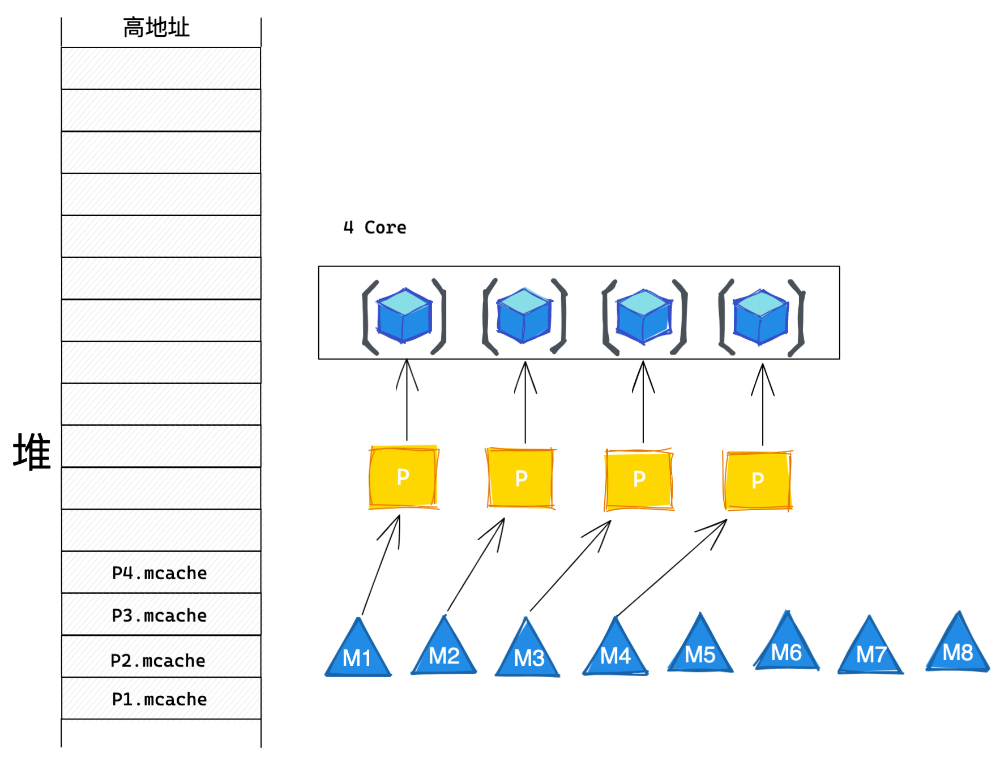

### 2. 资源竞争严重 & Goroutine传递问题 - P构建本地G队列

为了减少全局锁的竞争，很常见的思路就是减少锁的粒度，在原有全局G队列的基础上，在每个P上也维护了本地G队列，并且保留全局G队列，作为一个G的暂存空间 & 负载均衡使用。而且本G创建的G'优先放入本地队列，很好的保证了局部性。

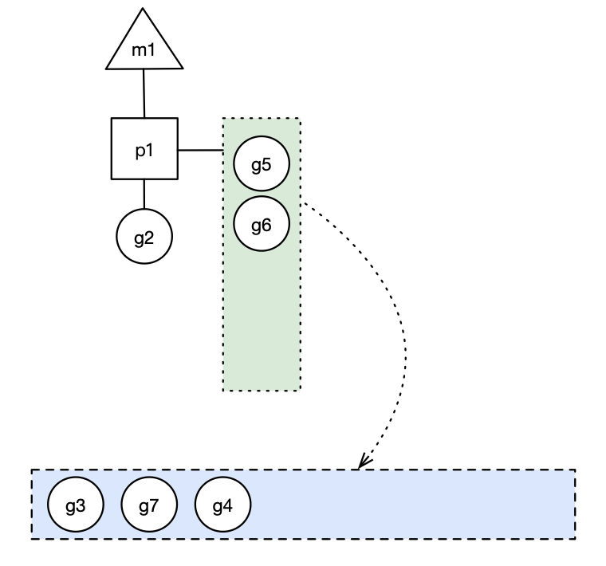

#### 1.新建Goroutine

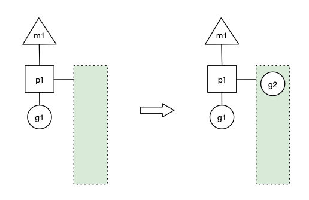

p1拥有g1，m1获取p1后开始运行g1，g1使用`go func()`创建了g2，为了局部性g2优先加入到p1的本地队列。

#### 2.Goroutine切换

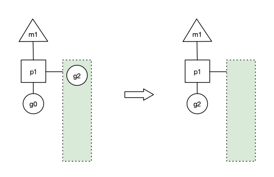

#### 3.全局队列和本地G队列负载均衡

因为每个p都维护了本地队列，但是这些队列可能存在G不均匀的情况，例如一个P下的G疯狂的在go func()，那么很快P的本地G队列就要满了，如果P创建的G都在P执行的话，那么会出现一核拼命跑，另外几个核在旁边吃瓜的情况，所以引入了负载均衡的策略，当本地G队列满了之后，将一部分G转移到全局G队列，其他P本地G队列空了后，可以从全局队列，来使G均匀的运行在所有P上。


假设每个p的本地队列只能存4个g。g2要创建了6个g，前4个g（g3, g4, g5, g6）已经加入p1的本地队列，p1本地队列满了。


g2在创建g7的时候，发现p1的本地队列已满，需要执行**负载均衡**，把p1中本地队列中前一半的g，还有新创建的g**转移**到全局队列（实现中并不一定是新的g，如果g是g2之后就执行的，会被保存在本地队列，利用某个老的g替换新g加入全局队列），这些g被转移到全局队列时，会被打乱顺序。所以g3,g4,g7被转移到全局队列。

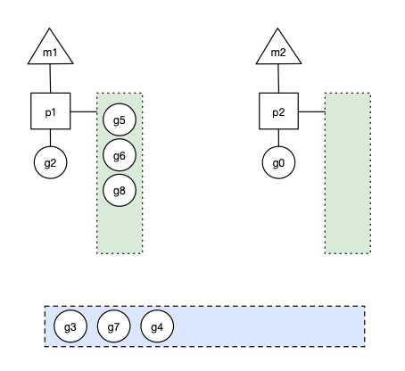

从全局看，假设还有另外的p2绑定了m2，并且本地队列为空（m自旋状态）

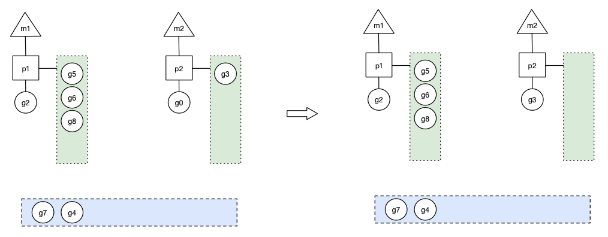

此时m2尝试从全局队列(GQ)取一批g放到p2的本地队列（函数：`findrunnable`）。m2从全局队列取的g数量符合下面的公式：

```go
n = min(len(GQ)/GOMAXPROCS + 1, len(GQ/2))
```

总体的含义是说，至少从全局G中拿1个G，但是又不会获取过多，会给其他P预留一些。

#### 4.本地G队列负载均衡

除了从全局队列中获取G来运行之外，当全局队列为空时，P还会尝试从其他P的本地队列偷取一些来运行，反正总而言之就是让G在全局P上均匀的运行。

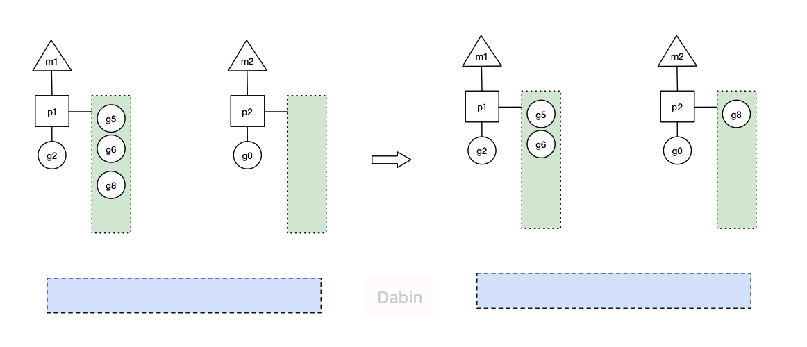

由此可见，当全局队列为空时，自旋的P2会从P2的本地队列中偷取一半到本地队列进行运行。

### 3. 频繁的线程阻塞

针对Goroutine的不同阻塞情况，GMP模型做了更细化的处理，目的就是为了减少线程阻塞时间，把阻塞的G及时的让出CPU去运行其他线程。

在go中阻塞主要分为以下四种场景：

1. 原子性，互斥量或者channel操作导致的Goroutine阻塞
2. 由于网络请求和IO操作导致的Goroutine阻塞
3. 调用一些系统方法时，例如文件读写导致Goroutine阻塞
4. Goroutine中执行了sleep操作导致Goroutine阻塞

#### NetPoller Thread - 网络请求和 IO阻塞

由于网络请求和 IO 操作导致 Goroutine 阻塞。Go 程序提供了网络轮询器（NetPoller）来处理网络请求和 IO 操作的问题。

其后台通过 kqueue（MacOS），epoll（Linux）或 iocp（Windows）来实现 IO 多路复用。

通过使用 NetPoller 进行网络系统调用，调度器可以防止 Goroutine 在进行这些系统调用时阻塞 M。这可以让 M 执行 P 的 LRQ 中其他的 Goroutines，而不需要创建新的 M。执行网络系统调用不需要额外的 M，**网络轮询器使用系统线程**

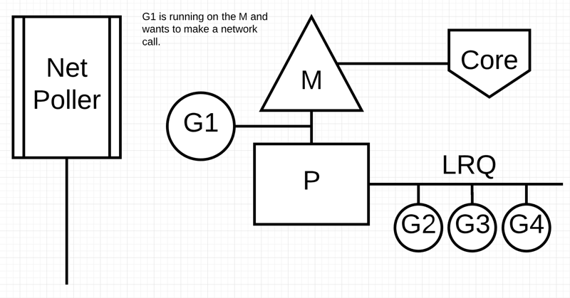

当前G1要进行网络请求，此时G1会被转移到NetPoller进行托管，P从本地G队列获取G2给到M继续执行。

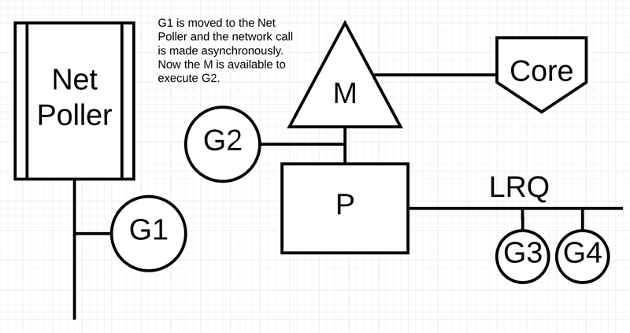

G1执行完成后，G1放入原P的本地队列，继续等待执行

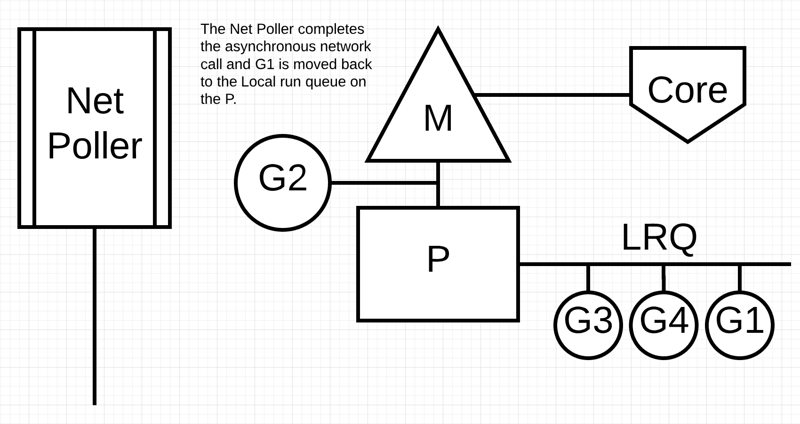

#### 系统调用阻塞

G1即将进行阻塞型的同步系统调用

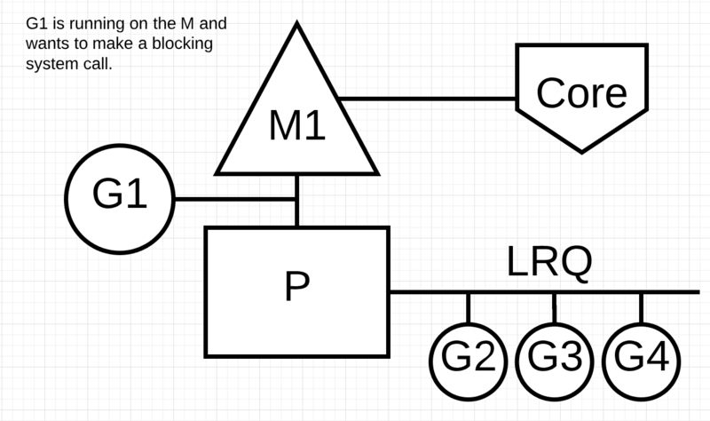

调度器会将M1，G1和P进行分离，同时引入新的M2来服务P

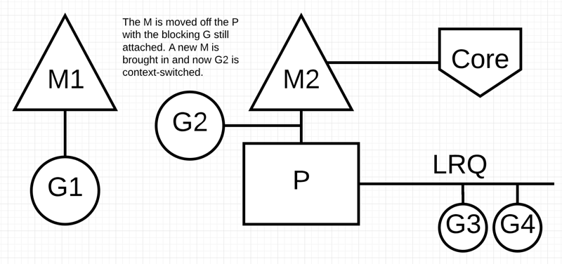

当G1系统调用完成后，G1会回归P的本地队列，等待继续执行

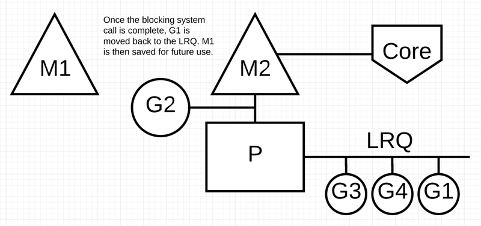

## 四、抢占式调度器 · [1.2](https://github.com/golang/go/blob/go1.2/src/pkg/runtime/proc.c) ~ 至今

#### sysmon线程

上一个版本，引入了P等一系列措施，基本上解决了GM模型存在的一些问题

我们来回顾下GM模型带来的问题：

- ~~mcache泛滥~~
- ~~资源竞争严重~~
- ~~Goroutine传递问题~~
- 频繁的线程阻塞/解阻塞

除了最后一个问题，我们拆开来看

在go中阻塞主要分为以下四种场景：

1. 原子性，互斥量或者channel操作导致的Goroutine阻塞
2. ~~由于网络请求和IO操作导致的Goroutine阻塞~~
3. ~~调用一些系统方法时，例如文件读写导致Goroutine阻塞~~
4. Goroutine中执行了sleep操作导致Goroutine阻塞

针对Goroutine内部的诸如原子访问，锁，channel阻塞以及sleep函数休眠等造成的阻塞，GMP借助了系统监控线程sysmon来进行解决，它会每隔一段时间**检查 Go 语言runtime**，确保程序没有进入异常状态。

系统监控的触发时间就会稳定在 10ms，功能比较多:

1. 检查死锁runtime.checkdead
2. 运行计时器 — 获取下一个需要被触发的计时器；
3. 定时从 netpoll 中获取 ready 的协程
4. [Go 的抢占式调度](https://mp.weixin.qq.com/s/d7FdGBc0S0V3S4aRL4EByA)

### 4.1 基于协作的抢占式调度器 - 1.2 ~ 1.13

#### 原理

当 sysmon 发现 M 已运行同一个 G（Goroutine）10ms 以上时，它会将该 G 的内部参数 preempt 设置为 true。然后，在函数序言中，当 G 进行函数调用时，G 会检查自己的 preempt 标志，如果它为 true，则它将自己与 M 分离并推入“全局队列”。

#### 问题

由于它的工作方式（函数调用触发），在 `for{}` 的情况下并不会发生抢占，如果没有函数调用，即使设置了抢占标志，也不会进行该标志的检查

```go
func main() {
    var x int
    threads := runtime.GOMAXPROCS(0)
    for i := 0; i < threads; i++ {
        go func() {
            for { x++ }
        }()
    }
    time.Sleep(time.Second)
    fmt.Println("x =", x)
}
```

运行结果：

启动了和cpu核心数相同的g，每个g都绑定了一个p，但是每个又进入了for循环，不存在调度点，所有的P都在执行for循环，此时永远都不会到达print。

```go
func main() {
    var x int
    threads := runtime.GOMAXPROCS(0) - 1
    for i := 0; i < threads; i++ {
        go func() {
            for { x++ }
        }()
    }
    time.Sleep(time.Second)
    fmt.Println("x =", x)
}
```

运行结果

```
x = 0
```

### 4.2 基于信号的抢占式调度器 - 1.14 ~ 至今

#### 原理

Go1.14 引入抢占式调度（使用信号的异步抢占机制），sysmon 仍然会检测到运行了 10ms 以上的 G（goroutine）。然后，sysmon 向运行 G 的 P 发送信号（SIGURG）。Go 的信号处理程序会调用P上的一个叫作 gsignal 的 goroutine 来处理该信号，将其映射到 M 而不是 G，并使其检查该信号。gsignal 看到抢占信号，停止正在运行的 G。

### 4.3 GMP Scheduler角色介绍


#### G

goroutine是运行时的最小执行单元

```go
type g struct {
    // Stack parameters.
    // stack describes the actual stack memory: [stack.lo, stack.hi).
    // stackguard0 is the stack pointer compared in the Go stack growth prologue.
    // It is stack.lo+StackGuard normally, but can be StackPreempt to trigger a preemption.
    // stackguard1 is the stack pointer compared in the C stack growth prologue.
    // It is stack.lo+StackGuard on g0 and gsignal stacks.
    // It is ~0 on other goroutine stacks, to trigger a call to morestackc (and crash).
  // 当前g使用的栈空间，stack结构包括 [lo, hi]两个成员
    stack       stack   // offset known to runtime/cgo
  // 用于检测是否需要进行栈扩张，go代码使用
    stackguard0 uintptr // offset known to liblink
  // 用于检测是否需要进行栈扩展，原生代码使用的
    stackguard1 uintptr // offset known to liblink
  // 当前g所绑定的m
    m              *m      // current m; offset known to arm liblink
  // 当前g的调度数据，当goroutine切换时，保存当前g的上下文，用于恢复
    sched          gobuf
    // g当前的状态
    atomicstatus   uint32
  // 当前g的id
    goid           int64
  // 下一个g的地址，通过guintptr结构体的ptr set函数可以设置和获取下一个g，通过这个字段和sched.gfreeStack sched.gfreeNoStack 可以把 free g串成一个链表
    schedlink      guintptr
  // 判断g是否允许被抢占
    preempt        bool       // preemption signal, duplicates stackguard0 = stackpreempt
    // g是否要求要回到这个M执行, 有的时候g中断了恢复会要求使用原来的M执行
    lockedm        muintptr
}
```

#### M

系统线程封装

```go
type m struct {
   // g0是用于调度和执行系统调用的特殊g
   g0      *g     // goroutine with scheduling stack
     // m当前运行的g
   curg          *g       // current running goroutine
   // 当前拥有的p
   p             puintptr // attached p for executing go code (nil if not executing go code)
   // 线程的 local storage
   tls           [6]uintptr   // thread-local storage
   // 唤醒m时，m会拥有这个p
   nextp         puintptr
   id            int64
   // 如果 !="", 继续运行curg
   preemptoff    string // if != "", keep curg running on this m
   // 自旋状态，用于判断m是否工作已结束，并寻找g进行工作
   spinning      bool // m is out of work and is actively looking for work
   // 用于判断m是否进行休眠状态
   blocked       bool // m is blocked on a note
     // m休眠和唤醒通过这个，note里面有一个成员key，对这个key所指向的地址进行值的修改，进而达到唤醒和休眠的目的
   park          note
   // 所有m组成的一个链表
   alllink       *m // on allm
   // 下一个m，通过这个字段和sched.midle 可以串成一个m的空闲链表
   schedlink     muintptr
   // mcache，m拥有p的时候，会把自己的mcache给p
   mcache        *mcache
   // lockedm的对应值
   lockedg       guintptr
   // 待释放的m的list，通过sched.freem 串成一个链表
   freelink      *m      // on sched.freem
}
```

#### P

P是M运行G所需的资源

```go
type p struct {
   lock mutex

   id          int32
   // p的状态，稍后介绍
   status      uint32 // one of pidle/prunning/...
   // 下一个p的地址，可参考 g.schedlink
   link        puintptr
   // p所关联的m
   m           muintptr   // back-link to associated m (nil if idle)
   // 内存分配的时候用的，p所属的m的mcache用的也是这个
   mcache      *mcache

   // Cache of goroutine ids, amortizes accesses to runtime·sched.goidgen.
   // 从sched中获取并缓存的id，避免每次分配goid都从sched分配
     goidcache    uint64
     goidcacheend uint64

   // Queue of runnable goroutines. Accessed without lock.
   // p 本地的runnbale的goroutine形成的队列
   runqhead uint32
   runqtail uint32
   runq     [256]guintptr
   // runnext, if non-nil, is a runnable G that was ready'd by
   // the current G and should be run next instead of what's in
   // runq if there's time remaining in the running G's time
   // slice. It will inherit the time left in the current time
   // slice. If a set of goroutines is locked in a
   // communicate-and-wait pattern, this schedules that set as a
   // unit and eliminates the (potentially large) scheduling
   // latency that otherwise arises from adding the ready'd
   // goroutines to the end of the run queue.
   // 下一个执行的g，如果是nil，则从队列中获取下一个执行的g
   runnext guintptr

   // Available G's (status == Gdead)
   // 状态为 Gdead的g的列表，可以进行复用
   gfree    *g
   gfreecnt int32
}
```

可以看到，P上维护了mcache，并且维护了本地的runq队列。并且所有的P相互关联。

#### Sched

```go
var allp [_MaxGomaxprocs + 1]*p

type schedt struct {
   // 全局的go id分配
   goidgen  uint64
   // 记录的最后一次从i/o中查询g的时间
   lastpoll uint64

   lock mutex

   // When increasing nmidle, nmidlelocked, nmsys, or nmfreed, be
   // sure to call checkdead().
     // m的空闲链表，结合m.schedlink 就可以组成一个空闲链表了
   midle        muintptr // idle m's waiting for work
   nmidle       int32    // number of idle m's waiting for work
   nmidlelocked int32    // number of locked m's waiting for work
   // 下一个m的id，也用来记录创建的m数量
   mnext        int64    // number of m's that have been created and next M ID
   // 最多允许的m的数量
   maxmcount    int32    // maximum number of m's allowed (or die)
   nmsys        int32    // number of system m's not counted for deadlock
   // free掉的m的数量，exit的m的数量
   nmfreed      int64    // cumulative number of freed m's

   ngsys uint32 // number of system goroutines; updated atomically

   pidle      puintptr // idle p's
   npidle     uint32
   nmspinning uint32 // See "Worker thread parking/unparking" comment in proc.go.

   // Global runnable queue.
   // 这个就是全局的g的队列了，如果p的本地队列没有g或者太多，会跟全局队列进行平衡
   // 根据runqhead可以获取队列头的g，然后根据g.schedlink 获取下一个，从而形成了一个链表
   runqhead guintptr
   runqtail guintptr
   runqsize int32

   // freem is the list of m's waiting to be freed when their
   // m.exited is set. Linked through m.freelink.
   // 等待释放的m的列表
   freem *m
}
```

全局结构上新增了全局的p列表，并且和sched结构拆分了，减少锁竞争

### 4.4 GMP 整体一张图


### 4.5 程序初始化

go的启动流程分为4步

1. call osinit， 这里就是设置了全局变量ncpu = cpu核心数量
2. call schedinit
3. make & queue new G （runtime.newproc, go func()也是调用这个函数来创建goroutine）
4. call runtime·mstart

和GM模型启动流程没有改变

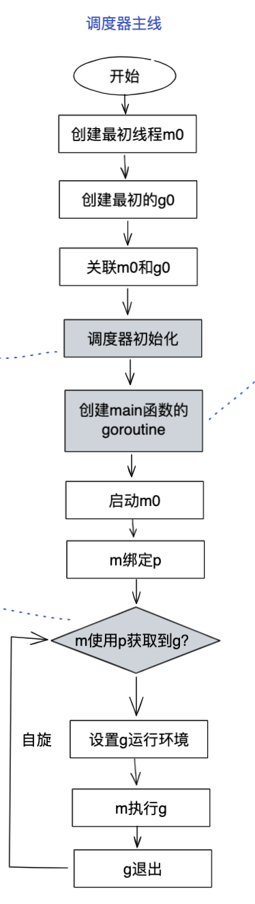

### 4.6 调度器初始化

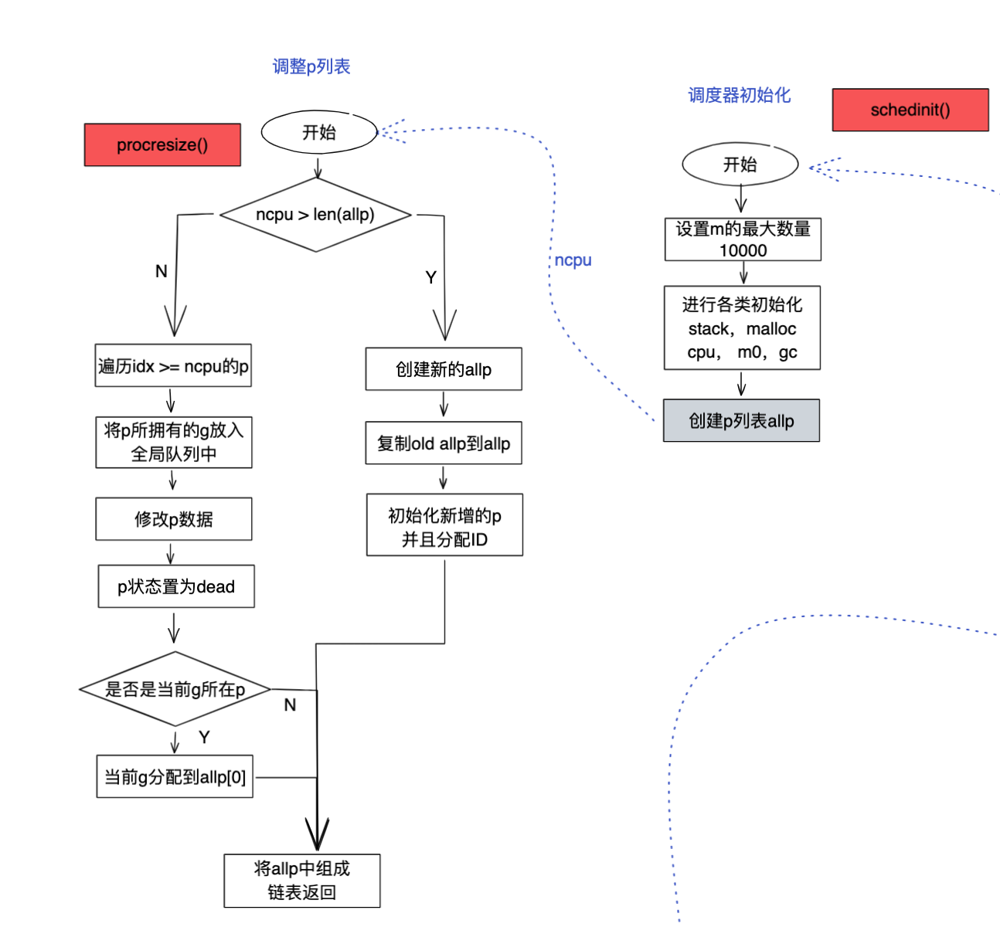

schedinit这里对当前m进行了初始化，并根据osinit获取到的cpu核数和设置的`GOMAXPROCS` 确定p的数量，并进行初始化

```go
func schedinit() {
    // 从TLS或者专用寄存器获取当前g的指针类型
    _g_ := getg()
    // 设置m最大的数量
    sched.maxmcount = 10000

    // 初始化栈的复用空间
    stackinit()
    // 初始化当前m
    mcommoninit(_g_.m)

    // osinit的时候会设置 ncpu这个全局变量，这里就是根据cpu核心数和参数GOMAXPROCS来确定p的数量
    procs := ncpu
    if n, ok := atoi32(gogetenv("GOMAXPROCS")); ok && n > 0 {
        procs = n
    }
    // 生成设定数量的p
    if procresize(procs) != nil {
        throw("unknown runnable goroutine during bootstrap")
    }
}
```

procresize函数更改p的数量，多退少补的原则，在初始化过程中，由于最开始是没有p的，所以这里的作用就是初始化设定数量的p了

```go
func procresize(nprocs int32) *p {
    old := gomaxprocs
    if old < 0 || nprocs <= 0 {
        throw("procresize: invalid arg")
    }
    // update statistics
    now := nanotime()
    if sched.procresizetime != 0 {
        sched.totaltime += int64(old) * (now - sched.procresizetime)
    }
    sched.procresizetime = now

    // Grow allp if necessary.
    // 如果新给的p的数量比原先的p的数量多，则新建增长的p
    if nprocs > int32(len(allp)) {
        // Synchronize with retake, which could be running
        // concurrently since it doesn't run on a P.
        lock(&allpLock)
        // 判断allp 的cap是否满足增长后的长度，满足就直接使用，不满足，则需要扩张这个slice
        if nprocs <= int32(cap(allp)) {
            allp = allp[:nprocs]
        } else {
            nallp := make([]*p, nprocs)
            // Copy everything up to allp's cap so we
            // never lose old allocated Ps.
            copy(nallp, allp[:cap(allp)])
            allp = nallp
        }
        unlock(&allpLock)
    }

    // initialize new P's
    // 初始化新增的p
    for i := int32(0); i < nprocs; i++ {
        pp := allp[i]
        if pp == nil {
            pp = new(p)
            pp.id = i
            pp.status = _Pgcstop
            pp.sudogcache = pp.sudogbuf[:0]
            for i := range pp.deferpool {
                pp.deferpool[i] = pp.deferpoolbuf[i][:0]
            }
            pp.wbBuf.reset()
            // allp是一个slice，直接将新增的p放到对应的索引下面就ok了
            atomicstorep(unsafe.Pointer(&allp[i]), unsafe.Pointer(pp))
        }
        if pp.mcache == nil {
            // 初始化时，old=0，第一个新建的p给当前的m使用
            if old == 0 && i == 0 {
                if getg().m.mcache == nil {
                    throw("missing mcache?")
                }
                pp.mcache = getg().m.mcache // bootstrap
            } else {
                // 为p分配内存
                pp.mcache = allocmcache()  //*******为P分配mcache********
            }
        }
    }

    // free unused P's
    // 释放掉多余的p，当新设置的p的数量，比原先设定的p的数量少的时候，会走到这个流程
    // 通过 runtime.GOMAXPROCS 就可以动态的修改nprocs
    for i := nprocs; i < old; i++ {
        p := allp[i]
        // move all runnable goroutines to the global queue
        // 把当前p的运行队列里的g转移到全局的g的队列
        for p.runqhead != p.runqtail {
            // pop from tail of local queue
            p.runqtail--
            gp := p.runq[p.runqtail%uint32(len(p.runq))].ptr()
            // push onto head of global queue
            globrunqputhead(gp)
        }
        // 把runnext里的g也转移到全局队列
        if p.runnext != 0 {
            globrunqputhead(p.runnext.ptr())
            p.runnext = 0
        }
        // if there's a background worker, make it runnable and put
        // it on the global queue so it can clean itself up
        // 如果有gc worker的话，修改g的状态，然后再把它放到全局队列中
        if gp := p.gcBgMarkWorker.ptr(); gp != nil {
            casgstatus(gp, _Gwaiting, _Grunnable)
            globrunqput(gp)
            // This assignment doesn't race because the
            // world is stopped.
            p.gcBgMarkWorker.set(nil)
        }
        // sudoig的buf和cache，以及deferpool全部清空
        for i := range p.sudogbuf {
            p.sudogbuf[i] = nil
        }
        p.sudogcache = p.sudogbuf[:0]
        for i := range p.deferpool {
            for j := range p.deferpoolbuf[i] {
                p.deferpoolbuf[i][j] = nil
            }
            p.deferpool[i] = p.deferpoolbuf[i][:0]
        }
        // 释放掉当前p的mcache
        freemcache(p.mcache)
        p.mcache = nil
        // 把当前p的gfree转移到全局
        gfpurge(p)
        // 修改p的状态，让他自生自灭去了
        p.status = _Pdead
        // can't free P itself because it can be referenced by an M in syscall
    }

    // Trim allp.
    if int32(len(allp)) != nprocs {
        lock(&allpLock)
        allp = allp[:nprocs]
        unlock(&allpLock)
    }
    // 判断当前g是否有p，有的话更改当前使用的p的状态，继续使用
    _g_ := getg()
    if _g_.m.p != 0 && _g_.m.p.ptr().id < nprocs {
        // continue to use the current P
        _g_.m.p.ptr().status = _Prunning
    } else {
        // release the current P and acquire allp[0]
        // 如果当前g有p，但是拥有的是已经释放的p，则不再使用这个p，重新分配
        if _g_.m.p != 0 {
            _g_.m.p.ptr().m = 0
        }
        // 分配allp[0]给当前g使用
        _g_.m.p = 0
        _g_.m.mcache = nil
        p := allp[0]
        p.m = 0
        p.status = _Pidle
        // 将p m g绑定，并把m.mcache指向p.mcache，并修改p的状态为_Prunning
        acquirep(p)
    }
    var runnablePs *p
    for i := nprocs - 1; i >= 0; i-- {
        p := allp[i]
        if _g_.m.p.ptr() == p {
            continue
        }
        p.status = _Pidle
        // 根据 runqempty 来判断当前p的g运行队列是否为空
        if runqempty(p) {
            // g运行队列为空的p，放到 sched的pidle队列里面
            pidleput(p)
        } else {
            // g 运行队列不为空的p，组成一个可运行队列，并最后返回
            p.m.set(mget())
            p.link.set(runnablePs)
            runnablePs = p
        }
    }
    stealOrder.reset(uint32(nprocs))
    var int32p *int32 = &gomaxprocs // make compiler check that gomaxprocs is an int32
    atomic.Store((*uint32)(unsafe.Pointer(int32p)), uint32(nprocs))
    return runnablePs
}
```

上面这一步可以看到，为P分配了mcache

### 4.7 协程创建

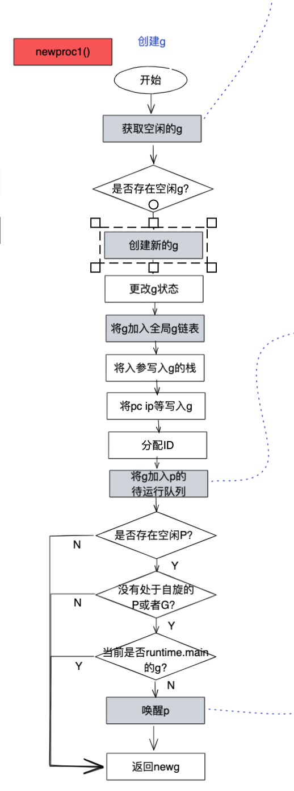

仍然是调用newproc1函数，和GM模型的区别是，先获取空闲的g复用，之后优先加入p本地运行g队列中，否则放入全局队列中。

```go
func newproc1(fn *funcval, argp *uint8, narg int32, callergp *g, callerpc uintptr) {
    _g_ := getg()

    if fn == nil {
        _g_.m.throwing = -1 // do not dump full stacks
        throw("go of nil func value")
    }
    // 加锁禁止被抢占
    _g_.m.locks++ // disable preemption because it can be holding p in a local var
    siz := narg
    siz = (siz + 7) &^ 7

    // We could allocate a larger initial stack if necessary.
    // Not worth it: this is almost always an error.
    // 4*sizeof(uintreg): extra space added below
    // sizeof(uintreg): caller's LR (arm) or return address (x86, in gostartcall).
    // 如果参数过多，则直接抛出异常，栈大小是2k
    if siz >= _StackMin-4*sys.RegSize-sys.RegSize {
        throw("newproc: function arguments too large for new goroutine")
    }

    _p_ := _g_.m.p.ptr()
    // 尝试获取一个空闲的g，如果获取不到，则新建一个，并添加到allg里面
    // gfget首先会尝试从p本地获取空闲的g，如果本地没有的话，则从全局获取一堆平衡到本地p
    newg := gfget(_p_)
    if newg == nil {
        newg = malg(_StackMin)
        casgstatus(newg, _Gidle, _Gdead)
        // 新建的g，添加到全局的 allg里面，allg是一个slice， append进去即可
        allgadd(newg) // publishes with a g->status of Gdead so GC scanner doesn't look at uninitialized stack.
    }
    // 判断获取的g的栈是否正常
    if newg.stack.hi == 0 {
        throw("newproc1: newg missing stack")
    }
    // 判断g的状态是否正常
    if readgstatus(newg) != _Gdead {
        throw("newproc1: new g is not Gdead")
    }
    // 预留一点空间，防止读取超出一点点
    totalSize := 4*sys.RegSize + uintptr(siz) + sys.MinFrameSize // extra space in case of reads slightly beyond frame
    // 空间大小进行对齐
    totalSize += -totalSize & (sys.SpAlign - 1) // align to spAlign
    sp := newg.stack.hi - totalSize
    spArg := sp
    // usesLr 为0，这里不执行
    if usesLR {
        // caller's LR
        *(*uintptr)(unsafe.Pointer(sp)) = 0
        prepGoExitFrame(sp)
        spArg += sys.MinFrameSize
    }
    if narg > 0 {
        // 将参数拷贝入栈
        memmove(unsafe.Pointer(spArg), unsafe.Pointer(argp), uintptr(narg))
        // ... 省略 ...
    }
    // 初始化用于保存现场的区域及初始化基本状态
    memclrNoHeapPointers(unsafe.Pointer(&newg.sched), unsafe.Sizeof(newg.sched))
    newg.sched.sp = sp
    newg.stktopsp = sp
    // 这里保存了goexit的地址，在用户函数执行完成后，会根据pc来执行goexit
    newg.sched.pc = funcPC(goexit) + sys.PCQuantum // +PCQuantum so that previous instruction is in same function
    newg.sched.g = guintptr(unsafe.Pointer(newg))
    // 这里调整 sched 信息，pc = goexit的地址
    gostartcallfn(&newg.sched, fn)
    newg.gopc = callerpc
    newg.ancestors = saveAncestors(callergp)
    newg.startpc = fn.fn
    if _g_.m.curg != nil {
        newg.labels = _g_.m.curg.labels
    }
    if isSystemGoroutine(newg) {
        atomic.Xadd(&sched.ngsys, +1)
    }
    newg.gcscanvalid = false
    casgstatus(newg, _Gdead, _Grunnable)
    // 如果p缓存的goid已经用完，本地再从sched批量获取一点
    if _p_.goidcache == _p_.goidcacheend {
        // Sched.goidgen is the last allocated id,
        // this batch must be [sched.goidgen+1, sched.goidgen+GoidCacheBatch].
        // At startup sched.goidgen=0, so main goroutine receives goid=1.
        _p_.goidcache = atomic.Xadd64(&sched.goidgen, _GoidCacheBatch)
        _p_.goidcache -= _GoidCacheBatch - 1
        _p_.goidcacheend = _p_.goidcache + _GoidCacheBatch
    }
    // 分配goid
    newg.goid = int64(_p_.goidcache)
    _p_.goidcache++
    // 把新的g放到 p 的可运行g队列中
    runqput(_p_, newg, true)
    // 判断是否有空闲p，且是否需要唤醒一个m来执行g
    if atomic.Load(&sched.npidle) != 0 && atomic.Load(&sched.nmspinning) == 0 && mainStarted {
        wakep()
    }
    _g_.m.locks--
    if _g_.m.locks == 0 && _g_.preempt { // restore the preemption request in case we've cleared it in newstack
        _g_.stackguard0 = stackPreempt
    }
}
```

同样的，仍然给g的callerpc写入goexit()函数的PC

**获取空闲g**

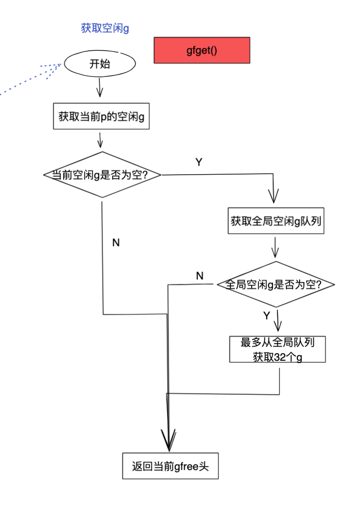

先从p本地获取空闲g，没有则从全局获取空闲g

**将g放入运行队列**

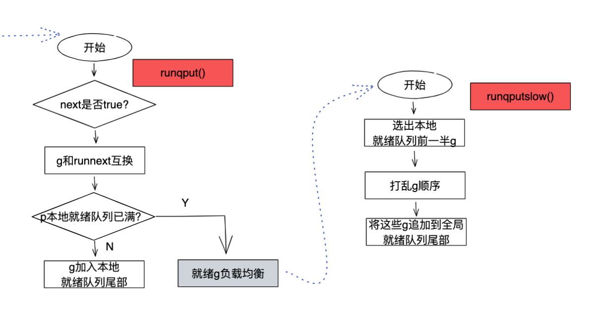

先尝试放入本地g队列，如果满了后，就尝试放入全局g队列

### 4.8 启动M

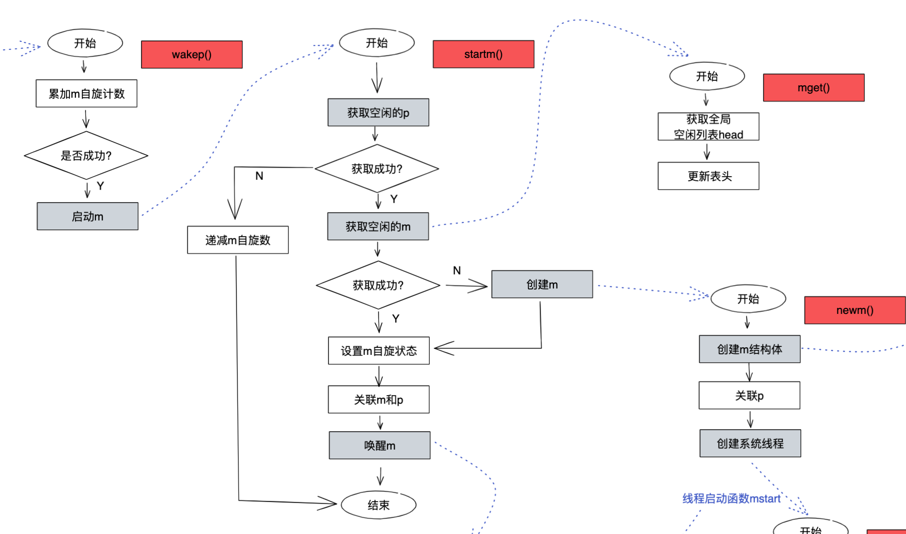

整体逻辑从之前的从g全局列表获取g变为了如果入参p!=nil，则为m找一个M（没有则创建），如果p==nil则尝试找到空闲P和M最匹配，并且最后唤醒m

```go
func startm(_p_ *p, spinning bool) {
    lock(&sched.lock)
    if _p_ == nil {
        // *********************如果没有指定p, 则从sched.pidle获取空闲的p*************************
        _p_ = pidleget()
        if _p_ == nil {
            unlock(&sched.lock)
            // 如果没有获取到p，重置nmspinning
            if spinning {
                // The caller incremented nmspinning, but there are no idle Ps,
                // so it's okay to just undo the increment and give up.
                if int32(atomic.Xadd(&sched.nmspinning, -1)) < 0 {
                    throw("startm: negative nmspinning")
                }
            }
            return
        }
    }
    // 首先尝试从 sched.midle获取一个空闲的m
    mp := mget()
    unlock(&sched.lock)
    if mp == nil {
        // 如果获取不到空闲的m，则创建一个 mspining = true的m，并将p绑定到m上，直接返回
        var fn func()
        if spinning {
            // The caller incremented nmspinning, so set m.spinning in the new M.
            fn = mspinning
        }
        newm(fn, _p_)
        return
    }
    // 判断获取到的空闲m是否是spining状态
    if mp.spinning {
        throw("startm: m is spinning")
    }
    // 判断获取到的m是否有p
    if mp.nextp != 0 {
        throw("startm: m has p")
    }
    if spinning && !runqempty(_p_) {
        throw("startm: p has runnable gs")
    }
    // The caller incremented nmspinning, so set m.spinning in the new M.
    // 调用函数的父函数已经增加了nmspinning， 这里只需要设置m.spining就ok了，同时把p绑上来
    mp.spinning = spinning
    mp.nextp.set(_p_)
    // 唤醒m
    notewakeup(&mp.park)
}
```

### 4.9 调度循环

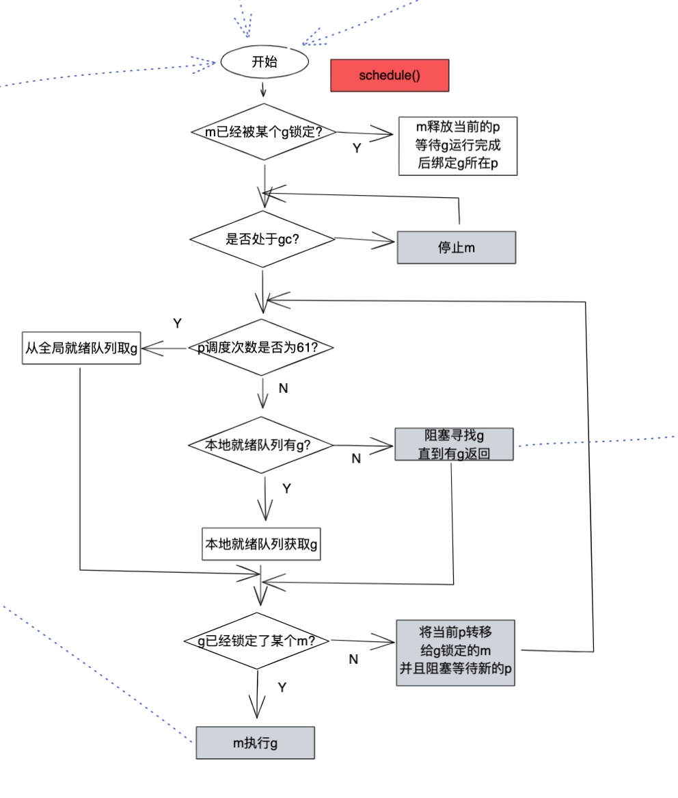

**schedule**

首先进行调度次数检测，如果大于某个数，则从全局获取g，然后m在P的资源下执行g

```go
func schedule() {
    _g_ := getg()

    if _g_.m.locks != 0 {
        throw("schedule: holding locks")
    }
    // 如果有lockg，停止执行当前的m
    if _g_.m.lockedg != 0 {
        // 解除lockedm的锁定，并执行当前g
        stoplockedm()
        execute(_g_.m.lockedg.ptr(), false) // Never returns.
    }

    // We should not schedule away from a g that is executing a cgo call,
    // since the cgo call is using the m's g0 stack.
    if _g_.m.incgo {
        throw("schedule: in cgo")
    }

top:
    // gc 等待
    if sched.gcwaiting != 0 {
        gcstopm()
        goto top
    }

    var gp *g
    var inheritTime bool

    if gp == nil {
        // Check the global runnable queue once in a while to ensure fairness.
        // Otherwise two goroutines can completely occupy the local runqueue
        // by constantly respawning each other.
        // 为了保证公平，每隔61次，从全局队列上获取g
        if _g_.m.p.ptr().schedtick%61 == 0 && sched.runqsize > 0 {
            lock(&sched.lock)
            gp = globrunqget(_g_.m.p.ptr(), 1)
            unlock(&sched.lock)
        }
    }
    if gp == nil {
        // 全局队列上获取不到待运行的g，则从p local队列中获取
        gp, inheritTime = runqget(_g_.m.p.ptr())
        if gp != nil && _g_.m.spinning {
            throw("schedule: spinning with local work")
        }
    }
    if gp == nil {
        // 如果p local获取不到待运行g，则开始查找，这个函数会从 全局 io poll， p locl和其他p local获取待运行的g，后面详细分析
        gp, inheritTime = findrunnable() // blocks until work is available
    }

    // This thread is going to run a goroutine and is not spinning anymore,
    // so if it was marked as spinning we need to reset it now and potentially
    // start a new spinning M.
    if _g_.m.spinning {
        // 如果m是自旋状态，取消自旋
        resetspinning()
    }

    if gp.lockedm != 0 {
        // Hands off own p to the locked m,
        // then blocks waiting for a new p.
        // 如果g有lockedm，则休眠上交p，休眠m，等待新的m，唤醒后从这里开始执行，跳转到top
        startlockedm(gp)
        goto top
    }
    // 开始执行这个g
    execute(gp, inheritTime)
}
```

最后，仍然是gogo函数执行g的用户代码，同时伪造了call指令的栈帧，将goexit()函数写入了SP上，ret指令结束后会跳转到goexit()函数继续执行

**goexit()**

```go
func goexit0(gp *g) {
    _g_ := getg()
    // 转换g的状态为dead，以放回空闲列表
    casgstatus(gp, _Grunning, _Gdead)
    if isSystemGoroutine(gp) {
        atomic.Xadd(&sched.ngsys, -1)
    }
    // 清空g的状态
    gp.m = nil
    locked := gp.lockedm != 0
    gp.lockedm = 0
    _g_.m.lockedg = 0
    gp.paniconfault = false
    gp._defer = nil // should be true already but just in case.
    gp._panic = nil // non-nil for Goexit during panic. points at stack-allocated data.
    gp.writebuf = nil
    gp.waitreason = 0
    gp.param = nil
    gp.labels = nil
    gp.timer = nil

    // Note that gp's stack scan is now "valid" because it has no
    // stack.
    gp.gcscanvalid = true
    dropg()

    // 把g放回空闲列表，以备复用
    gfput(_g_.m.p.ptr(), gp)
    // 再次进入调度循环
    schedule()
}
```

最后调用schedule函数开始下一轮调用。

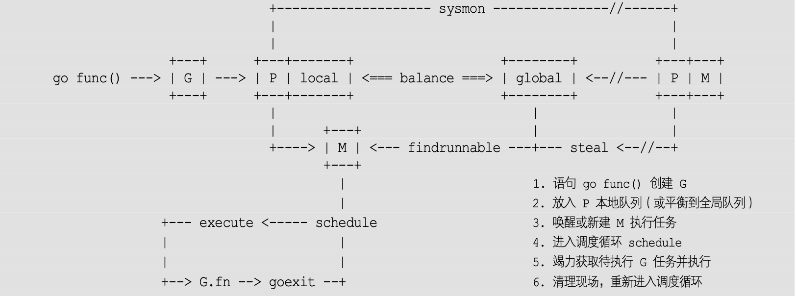

剩下的自己去看吧，我累了

## 五、非均匀存储访问调度器 · 提案

这个有兴趣自己研究吧

# 参考资料

- [这个GMP源码讲的比较清楚](https://segmentfault.com/a/1190000020254937#item-3-3)
- [go scheduler这十年发展历程](https://zhuanlan.zhihu.com/p/404698231?utm_source=wechat_session&utm_medium=social&utm_oi=1034005455210786816)
- [图解协程调度模型-GMP模型](https://segmentfault.com/a/1190000040364177)
- [GMP各种场景分析](https://learnku.com/articles/41728)
- [这哥们的文档大而全](https://qcrao.com/ishare/go-scheduler/#true%E6%BA%90%E7%A0%81%E9%98%85%E8%AF%BB)
- [这哥们马上出书了，从发展到代码都有涉及](https://draveness.me/golang/docs/part3-runtime/ch06-concurrency/golang-goroutine/#p)
- [大斌这哥们的系列文章-除了源码其他讲的非常清楚](https://lessisbetter.site/2019/03/10/golang-scheduler-1-history/)
- [GMP为什么有P-煎鱼](https://eddycjy.com/posts/go/go-tips-gmp-p/)
- [GMP和GM动态图](https://cloud.tencent.com/developer/article/1819618)
- [很火的scheduler英文文档翻译](https://segmentfault.com/a/1190000016038785)
