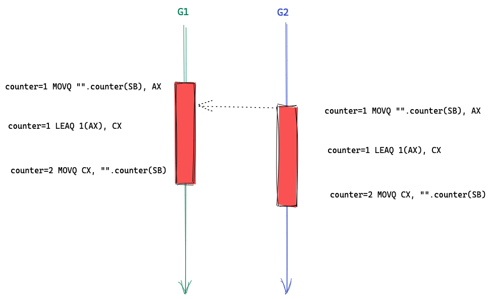
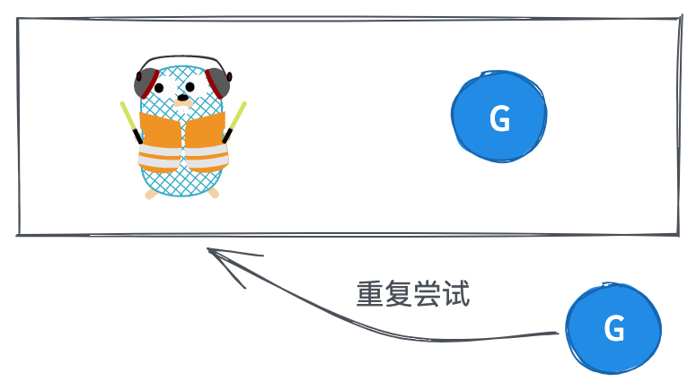
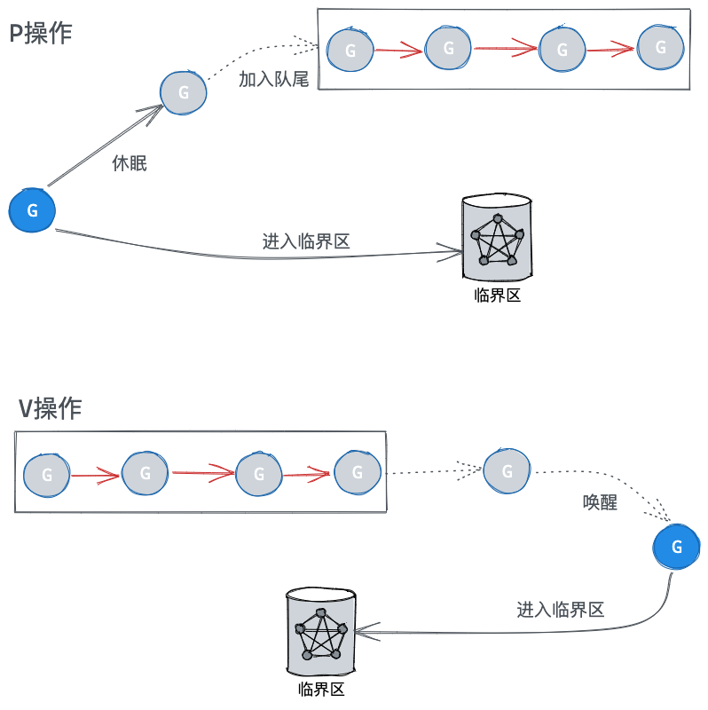
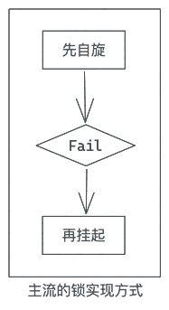
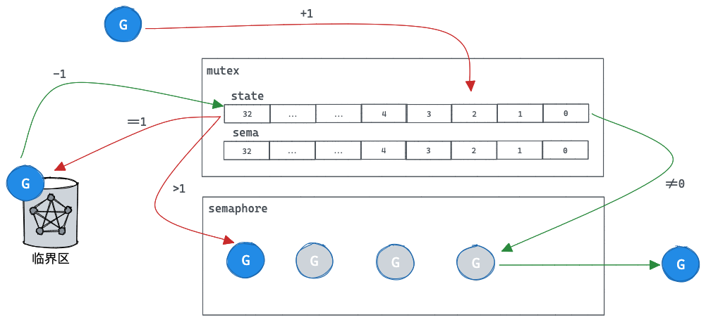
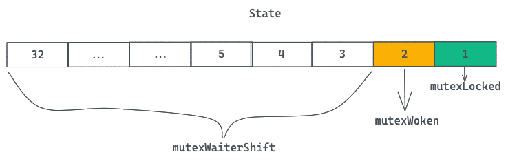
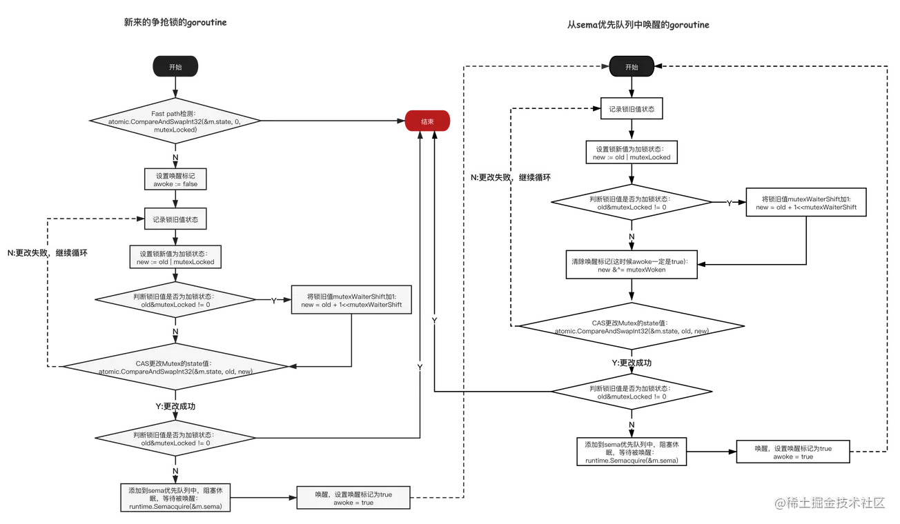
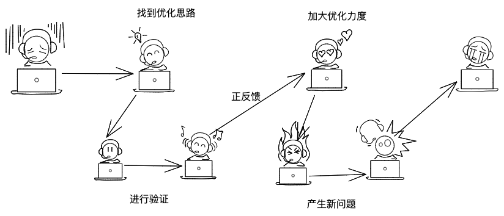
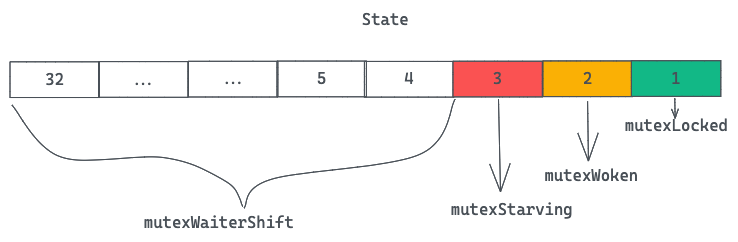
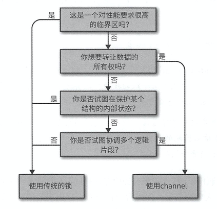

> sync.tmux：互斥锁，即如果锁被强占，后来的竞争者需要阻塞至锁被释放为止。

# 0、热身

## 0.1 原子操作粒度

```go
package main

import (
   "fmt"
   "sync"
)

func main() {
   var counter int64
   var wg sync.WaitGroup
   wg.Add(2)
   for i := 0; i < 2; i++ {
      go func() {
         defer wg.Done()
         for j := 0; j < 10000; j++ {
            counter++  //atomic.AddInt64(&counter, 1)
         }
      }()
   }
   wg.Wait()
   fmt.Println(counter)
}
```

结果会是两万吗？



大概率不是2w，且结果一定比2w小。我们可以知道，即使是简单的counter++，也不是原子的。底层会被拆分为多个机器寄存器操作。

## 0.2 如何处理并发竞争

当两个并发单元同时要访问一个资源时，且访问操作往往不是原子性的，这个时候我们就需要构造一定机制，对这块资源（临界区）进行保护，保证同一时间只有一个并发单元访问临界区。往往有两种方式：

### 0.2.1 自旋锁

也就是我们常说的自旋锁，如果发现资源被占用，我们持续的去尝试看资源是否已被释放。



**总结：并发单元会一直尝试抢占资源，一旦资源释放可立刻进行抢占，但是在阻塞期间CPU会被持续占用，适合持有锁较短的场景**

### 0.2.2 同步原语

另外一种方式使用同步原语来保证临界区的互斥性，即当发现资源被占用时，我们直接讲当前的并发单元进行休眠，等待资源被释放时唤醒进行资源抢占。信号量就是其中的一种。

信号量具备两种操作动作，称为V（`signal()`）与P（`wait()`）（即部分参考书常称的“PV操作”）。V操作会增加信号标S的数值，P操作会减少它。

运作方式：

- 设定初始的资源的数量。
- P 操作：将信号量的计数值减去 1，**如果新值已经为负，那么调用者会被阻塞并加入到等待队列中**。否则，调用者会继续执行，并且获得一个资源。
- V 操作：将信号量的计数值加 1，如果先前的计数值为负，就说明有等待的 P 操作的调用者。它会从等待队列中取出一个等待的调用者，唤醒它，让它继续执行。

那么，我们就简单的看下信号量是如何实现的：



可以看到维护了一个队列，用来存放未获取到信号量的G，新来的G放入队尾，并且队列中的G全部是休眠状态

当S被执行V操作，则从队列头部出队一个G进行唤醒，进入临界区

**总结：这种方式释放了CPU，在阻塞期间CPU可以去做其他的事情，但是唤醒并发单元开销巨大，往往适合持有锁很长的场景**

### 0.2.3 现实世界的妥协

那么，两种方式都有各自的优缺点，但是现实世界中，持有锁时间长短往往是不确定的，那么我们往往会进行缝合操作。



先进行自旋，若自旋达到上限次数仍未拿到锁，那么再挂起当前并发单元。

> 至此，热身完毕，我们来进入正题，看golang的互斥锁如何实现

# 1、初版锁实现

[初版锁的实现](https://github.com/golang/go/blob/release.r56/src/pkg/sync/mutex.go)，只是简单的套用了同步原语的范式，其中等待队列由runtime.Semacquire信号量实现。

```go
package sync

import (
    "runtime"
    "sync/atomic"
)


//互斥锁结构
type Mutex struct {
    key  int32
    sema uint32
}

//请求锁
func (m *Mutex) Lock() {
    if atomic.AddInt32(&m.key, 1) == 1 {    //标识加1，如果等于1，成功获取到锁
        return
    }
    runtime.Semacquire(&m.sema)     //否则阻塞等待
}


//释放锁
func (m *Mutex) Unlock() {
    switch v := atomic.AddInt32(&m.key, -1); {  //标识减1
    case v == 0:    //如果等于0，则没有等待者
        return
    case v == -1:   //如果等于-1，这种是异常情况，或者超过了最大可等待goroutine的数量
        panic("sync: unlock of unlocked mutex")
    }
    runtime.Semrelease(&m.sema) //唤醒其他阻塞的goroutine
}
```



这是最初mutex版本的实现，简单来说就是：

- 原子性的对一个变量key加一操作，第一个加一的为锁的持有者
- 剩余的视为未抢到锁，进入休眠
- 而当锁所有者释放锁时，对key进行减一操作，根据操作后key的值来走不同逻辑，
  - 如果key大于0，则说明存在阻塞者，此时只需要唤醒一个等待者即可（Semrelease）
  - 如果等于0则表示没有等待者，直接返回即可

其中，由于信号量中内部会维护一个先入先出队列，则能保证强锁的公平性。

其中，会导致panic的点如下：

- 对一个未上锁的锁进行解锁操作
- 当有过多的竞争者抢锁，int32到达上线后

# 2、改进版 - 给要抢锁的G多一次机会

[改进版](https://github.com/golang/go/blob/weekly.2011-07-07/src/pkg/sync/mutex.go)，我们需要知道一个现状，**G的唤醒与休眠是一个昂贵的操作**，而大部分加锁的临界区都比较小。

也就是说锁很可能很快就释放锁了，如果能让参与抢锁的G稍微再多一次重试，也许在下次重试时，锁已经被释放了，这样就免去了一次G的休眠和唤醒。

这个版本对state字段进行了拆分

- 

- 第二位，mutexWoken标记当前mutex上是否有已唤醒的G

- 后面的位数里存储了当前的等待者的数量，mutexWaiterShift则是偏移量，可以根据这个偏移量获取到当前waiter的数目

```go
// Copyright 2009 The Go Authors. All rights reserved.
// Use of this source code is governed by a BSD-style
// license that can be found in the LICENSE file.

// Package sync provides basic synchronization primitives such as mutual
// exclusion locks.  Other than the Once and WaitGroup types, most are intended
// for use by low-level library routines.  Higher-level synchronization is
// better done via channels and communication.
package sync

import (
    "runtime"
    "sync/atomic"
)

// A Mutex is a mutual exclusion lock.
// Mutexes can be created as part of other structures;
// the zero value for a Mutex is an unlocked mutex.
type Mutex struct {
    state int32
    sema  uint32
}

// A Locker represents an object that can be locked and unlocked.
type Locker interface {
    Lock()
    Unlock()
}

const (
    mutexLocked = 1 << iota // mutex is locked
    mutexWoken
    mutexWaiterShift = iota
)

// Lock locks m.
// If the lock is already in use, the calling goroutine
// blocks until the mutex is available.
func (m *Mutex) Lock() {
    // Fast path: grab unlocked mutex.
    if atomic.CompareAndSwapInt32(&m.state, 0, mutexLocked) {
        return
    }

    awoke := false
    for {
        old := m.state
        //先打上加锁标志
        new := old | mutexLocked
        //如果之前的锁的状态为已加锁，则等待G的数量+1
        if old&mutexLocked != 0 {
            new = old + 1<<mutexWaiterShift
        }
        //如果当前G是被唤醒的，则去掉mutexWoken标识
        if awoke {
            // The goroutine has been woken from sleep,
            // so we need to reset the flag in either case.
            new &^= mutexWoken
        }
        if atomic.CompareAndSwapInt32(&m.state, old, new) {
            //如果更新成功后，原来的状态是未加锁，则说明我们加锁成功
            if old&mutexLocked == 0 {
                break
            }
            //否则说明加锁失败，当前G挂起等待被唤醒
            runtime.Semacquire(&m.sema)
            awoke = true
        }
    }
}

// Unlock unlocks m.
// It is a run-time error if m is not locked on entry to Unlock.
//
// A locked Mutex is not associated with a particular goroutine.
// It is allowed for one goroutine to lock a Mutex and then
// arrange for another goroutine to unlock it.
func (m *Mutex) Unlock() {
    // Fast path: drop lock bit.
    //直接去掉state的加锁标识
    new := atomic.AddInt32(&m.state, -mutexLocked)
    if (new+mutexLocked)&mutexLocked == 0 {
        panic("sync: unlock of unlocked mutex")
    }

    old := new
    for {
        // If there are no waiters or a goroutine has already
        // been woken or grabbed the lock, no need to wake anyone.
        //如果当前等待者为0，或者当前锁已被加锁或者已经唤醒了一个G，则直接返回
        if old>>mutexWaiterShift == 0 || old&(mutexLocked|mutexWoken) != 0 {
            return
        }
        // Grab the right to wake someone.
        //接下来要做的就是唤醒一个G，前提是我们先成功修改了state
        //state上等待者数目-1，并且标识将要唤醒一个G
        new = (old - 1<<mutexWaiterShift) | mutexWoken
        if atomic.CompareAndSwapInt32(&m.state, old, new) {
            runtime.Semrelease(&m.sema)
            return
        }
        old = m.state
    }
}
```



## 加锁流程

1. 先尝试cas更新状态为已加锁，如果成功
   1. 则直接返回
2. 开启for 循环
   1. 保存当前状态old以备后续57行cas判断使用
   2. 创建一个新的状态new，并且打上加锁标识，以备后续进行更新
   3. 若old状态是已加锁
      1. 则本G则会变成等待者，所以新增new中等待者的值
   4. 如果当前是被唤醒状态
      1. 说明当前G是被唤醒的，则给new清楚调唤醒标识
   5. 进行cas更新状态，以old作为比较值，new作为更新值，如果更新成功
      1. 判断old是否是未加锁的状态，若是
         1. 直接返回，说明我们抢到了锁
      2. 否则，进入休眠，等待被唤醒，代码会停止在这一步
      3. 设置awoke为true，标识当前G被唤醒了
3. 开启下一轮for循环

## 解锁流程

1. 直接对加锁标识位-1
2. 判断变更后的new加锁标识位是否为-1，若是
   1. 则表示对未加锁的锁进行了解锁，直接panic
3. 保存当前锁状态old
4. 开启for循环，尝试唤醒一个等待者
   1. 判断当前锁是否不存在等待者了，或者当前锁已经被加锁了或者唤醒了，若是
      1. 则说明已经不需要我们再唤醒等待者了，直接返回即可，解锁完成
   2. 将状态的等待者数量减一，并且打上唤醒标识，赋值给new
   3. 更新锁状态，old作为比较值，new作为更新值，cas更新，若成功
      1. 调用信号量唤醒一个等待G
      2. 返回
   4. 重新读取当前锁状态到old
5. 开启下一轮for循环

对于加锁者来说，我需要做的就是在第一轮没抢到锁之后，再次尝试去进行抢锁，第二次有两种结果，一个是抢到了锁则直接返回，另一个是仍然没抢到，则我机会用完，直接进入休眠。

对于解锁者来说，我的任务一个是修改锁的加锁状态为未加锁，另外，我还要去尝试更新锁的状态为已唤醒，表示将要唤醒一个等待者，更新成功后，通过信号量唤醒一个G，解锁完毕。

**总体来说，这个版本的锁，给了第一次抢锁失败的竞争者一次另外的机会，再去抢一次锁，因为当前G还在CPU上，所以可以更小代价的获取到锁。但是这么做打破了原来的先到先得的公平性，越靠后的越有可能会抢到锁，且队列中的G抢到锁的概率会变小；同时，被唤醒的G如果没抢到锁，会被加入到队列的尾部，这近一步恶化了不公平的程度**

# 3、改进版 v2 - 给要抢锁的G更多的机会

上个版本，给抢锁的G多了一次机会，在一定程度上通过牺牲了cpu使用率与抢锁的公平性，换到了性能的提升。那么这一版本的改进就是，进一步的提高cpu占用率，看是否能获得更高的性能提升。

```go
// Copyright 2009 The Go Authors. All rights reserved.
// Use of this source code is governed by a BSD-style
// license that can be found in the LICENSE file.

// Package sync provides basic synchronization primitives such as mutual
// exclusion locks.  Other than the Once and WaitGroup types, most are intended
// for use by low-level library routines.  Higher-level synchronization is
// better done via channels and communication.
//
// Values containing the types defined in this package should not be copied.
package sync

import (
    "sync/atomic"
    "unsafe"
)

// A Mutex is a mutual exclusion lock.
// Mutexes can be created as part of other structures;
// the zero value for a Mutex is an unlocked mutex.
type Mutex struct {
    state int32
    sema  uint32
}

// A Locker represents an object that can be locked and unlocked.
type Locker interface {
    Lock()
    Unlock()
}

const (
    mutexLocked = 1 << iota // mutex is locked
    mutexWoken
    mutexWaiterShift = iota
)

// Lock locks m.
// If the lock is already in use, the calling goroutine
// blocks until the mutex is available.
func (m *Mutex) Lock() {
    // Fast path: grab unlocked mutex.
    if atomic.CompareAndSwapInt32(&m.state, 0, mutexLocked) {
        //忽略，竞争检测
        if raceenabled {
            raceAcquire(unsafe.Pointer(m))
        }
        return
    }

    awoke := false
    iter := 0
    for {
        old := m.state
        new := old | mutexLocked
        //如果之前的状态是已加锁
        if old&mutexLocked != 0 {
            //判断是否可以自旋
            if runtime_canSpin(iter) {
                // Active spinning makes sense.
                // Try to set mutexWoken flag to inform Unlock
                // to not wake other blocked goroutines.
                //这里比较难理解，因为引入了自旋，那么当解锁时，自旋的G比唤醒的G更大概率会抢到锁，
                //所以索性就不再唤醒G陪跑了
                if !awoke && old&mutexWoken == 0 && old>>mutexWaiterShift != 0 &&
                    atomic.CompareAndSwapInt32(&m.state, old, old|mutexWoken) {
                    awoke = true
                }
                runtime_doSpin()
                iter++
                continue
            }
            new = old + 1<<mutexWaiterShift
        }
        if awoke {
            // The goroutine has been woken from sleep,
            // so we need to reset the flag in either case.
            //如果当前G是被唤醒的，但是之前的锁状态mutexWoken标识为0，
            //说明state状态不对，代码有bug
            if new&mutexWoken == 0 {
                panic("sync: inconsistent mutex state")
            }
            //清除mutexWoken标识
            new &^= mutexWoken
        }
        //尝试去更新锁状态
        if atomic.CompareAndSwapInt32(&m.state, old, new) {
            if old&mutexLocked == 0 {
                break
            }
            runtime_Semacquire(&m.sema)
            awoke = true
            iter = 0
        }
    }

    if raceenabled {
        raceAcquire(unsafe.Pointer(m))
    }
}

// Unlock unlocks m.
// It is a run-time error if m is not locked on entry to Unlock.
//
// A locked Mutex is not associated with a particular goroutine.
// It is allowed for one goroutine to lock a Mutex and then
// arrange for another goroutine to unlock it.
func (m *Mutex) Unlock() {
    if raceenabled {
        _ = m.state
        raceRelease(unsafe.Pointer(m))
    }

    // Fast path: drop lock bit.
    //清除加锁标识
    new := atomic.AddInt32(&m.state, -mutexLocked)
    if (new+mutexLocked)&mutexLocked == 0 {
        panic("sync: unlock of unlocked mutex")
    }

    old := new
    for {
        // If there are no waiters or a goroutine has already
        // been woken or grabbed the lock, no need to wake anyone.
        if old>>mutexWaiterShift == 0 || old&(mutexLocked|mutexWoken) != 0 {
            return
        }
        // Grab the right to wake someone.
        new = (old - 1<<mutexWaiterShift) | mutexWoken
        if atomic.CompareAndSwapInt32(&m.state, old, new) {
            runtime_Semrelease(&m.sema)
            return
        }
        old = m.state
    }
}
```

这次的优化比较小，大致保留了之前的代码骨架，只是在Lock函数中增加了一个runtime_canSpin的检测，通过自旋的计数器iter，让当前G自旋等待一会，然后再去抢锁，这样加大了抢到锁的概率，同样的是以牺牲cpu使用率来换取了锁的性能。

为了实现多等一会的操作，我们最简单的操作就是sleep或者for循环一定次数，达到等待一阵子的目的，但是结合调度器来看，如果等待的时间过长的话，当前G会被打上抢占标识，可能会被调度让出cpu（这个概率很大），这正是我们希望避免的，所以我们引入了自旋操作，在自旋操作期间，我们可以保证当前G不会被调度出cpu。但是自旋一不小心就会造成死锁问题：

> 自旋的条件
> 
> - 积累的自旋次数小于最大的自旋次数（iter为当前自旋次数）
>   
>   - 凡事都得有个最大限制，对吧
> 
> - CPU核数大于1，且GOMAXPROCS>1，且至少存在一个正在运行的P，且当前G所在P的本地运行队列中没有G
>   
>   - 这么做的目的是为了保证自旋的指令流和解锁的指令流不在一个CPU核上运行，否则自旋没有意义

我们来看下新增的一些代码

```go
        if old&mutexLocked != 0 {
            if runtime_canSpin(iter) {
                // Active spinning makes sense.
                // Try to set mutexWoken flag to inform Unlock
                // to not wake other blocked goroutines.
                if !awoke && old&mutexWoken == 0 && old>>mutexWaiterShift != 0 &&
                    atomic.CompareAndSwapInt32(&m.state, old, old|mutexWoken) {
                    awoke = true
                }
                runtime_doSpin()
                iter++
                continue
            }
            new = old + 1<<mutexWaiterShift
        }
```

通过注释我们可以看到，在自旋开始之前，尝试对state字段打上唤醒标识，并且将自己伪造成刚被唤醒的G（awoke=true），这么做的目的呢，其实也是为了减少性能消耗，唤醒或者休眠都是奢侈操作，既然我当前G自旋，那么不用再唤醒额外的一个G参与竞争了。

# 先停下来分析下

事情往往是这样的，我们希望解决一个问题，想到了一个思路，进行了一些验证性的优化，拿到了一些不错的结果，然后我们会情不自禁的想随着这个思路加大优化力度，企图拿到更好的结果。那么新的问题往往也是在这个过程中产生的:P



我们分析了三版mutex的代码，也了解了当前的主要优化方向是 【通过提高锁竞争者的CPU持有时间，减少G的唤醒和休眠次数，来提高锁的整体性能】，那么这种优化思路给我们带来了哪些问题：

1. 破坏了竞争者的公平性
   1. 越后来的竞争者越容易获得锁
   2. 被唤醒的G如果竞争失败（大概率），会被放入队列尾部，进一步增加了阻塞时间
2. 出现了饥饿问题
   1. 基于第一条，那些已经在信号量等待队列中的G，可能很长时间或者永远也拿不到锁
3. 提高了CPU占用率
   1. 害，这个必须的

# 4、最终版本 - 横扫饥饿，做回自己

基于上述的问题，最大的就是饥饿问题，信号量等待队列中的G可能会长时间等待甚至一直等待，这就是饥饿问题，其主要原因有两个：

1. 自旋的G更容易获取到锁，从而导致等待队列中的G阻塞时间加长

2. 如果被唤醒的G竞争失败，会被放入队列尾部，进一步增加了阻塞时间

为了解决这个问题，新版本的锁做了如下修改：

1. 被唤醒的G如果未获取到锁，则放入队列的队首而不是队尾了

2. 当G等待时间超过了1ms，则锁的所有权直接从解锁的G转交给等待队列队首的G，新的G不再自旋，直接加入到队尾，即进入饥饿模式。

3. 当G拿到锁后，判断如果G是队列中最后一个，或者等待时间小于1ms，则将锁状态转为正常状态

[新版本的锁](https://github.com/golang/go/blob/go1.5/src/sync/mutex.go) 

相应的，state字段也新增了关于饥饿的标识位



我们先来看下代码：
Lock

```go
// Copyright 2009 The Go Authors. All rights reserved.
// Use of this source code is governed by a BSD-style
// license that can be found in the LICENSE file.

// Package sync provides basic synchronization primitives such as mutual
// exclusion locks. Other than the Once and WaitGroup types, most are intended
// for use by low-level library routines. Higher-level synchronization is
// better done via channels and communication.
//
// Values containing the types defined in this package should not be copied.
package sync

import (
    "internal/race"
    "sync/atomic"
    "unsafe"
)

func throw(string) // provided by runtime

// A Mutex is a mutual exclusion lock.
// The zero value for a Mutex is an unlocked mutex.
//
// A Mutex must not be copied after first use.
type Mutex struct {
    state int32
    sema  uint32
}

// A Locker represents an object that can be locked and unlocked.
type Locker interface {
    Lock()
    Unlock()
}

const (
    mutexLocked = 1 << iota // mutex is locked
    mutexWoken
    mutexStarving
    mutexWaiterShift = iota
    //等待阈值1ms
    starvationThresholdNs = 1e6
)

// Lock locks m.
// If the lock is already in use, the calling goroutine
// blocks until the mutex is available.
func (m *Mutex) Lock() {
    // Fast path: grab unlocked mutex.
    if atomic.CompareAndSwapInt32(&m.state, 0, mutexLocked) {
        if race.Enabled {
            race.Acquire(unsafe.Pointer(m))
        }
        return
    }
    // Slow path (outlined so that the fast path can be inlined)
    m.lockSlow()
}

func (m *Mutex) lockSlow() {
    var waitStartTime int64
    starving := false
    awoke := false
    iter := 0
    old := m.state
    for {
        // Don't spin in starvation mode, ownership is handed off to waiters
        // so we won't be able to acquire the mutex anyway.
        //只有当前锁已加锁且非饥饿状态，当前G才可以进行自旋
        //其余情况下自旋没有意义
        if old&(mutexLocked|mutexStarving) == mutexLocked && runtime_canSpin(iter) {
            // Active spinning makes sense.
            // Try to set mutexWoken flag to inform Unlock
            // to not wake other blocked goroutines.
            if !awoke && old&mutexWoken == 0 && old>>mutexWaiterShift != 0 &&
                atomic.CompareAndSwapInt32(&m.state, old, old|mutexWoken) {
                awoke = true
            }
            runtime_doSpin()
            iter++
            old = m.state
            continue
        }
        new := old
        // Don't try to acquire starving mutex, new arriving goroutines must queue.
        //如果之前状态非饥饿，才抢锁，如果之前状态是饥饿状态，那么当前G是需要去排队的
        if old&mutexStarving == 0 {
            new |= mutexLocked
        }
        //如果之前状态为饥饿状态，当前G挂起
        //如果之前状态已被加锁，当前G挂起
        if old&(mutexLocked|mutexStarving) != 0 {
            new += 1 << mutexWaiterShift
        }
        // The current goroutine switches mutex to starvation mode.
        // But if the mutex is currently unlocked, don't do the switch.
        // Unlock expects that starving mutex has waiters, which will not
        // be true in this case.
        //如果当前G等待大于1ms后被唤醒，且当前锁为已加锁状态，那么要更新下锁的状态为饥饿
        if starving && old&mutexLocked != 0 {
            new |= mutexStarving
        }
        if awoke {
            // The goroutine has been woken from sleep,
            // so we need to reset the flag in either case.
            if new&mutexWoken == 0 {
                throw("sync: inconsistent mutex state")
            }
            new &^= mutexWoken
        }
        if atomic.CompareAndSwapInt32(&m.state, old, new) {
            //如果之前状态是非已加锁，且非饥饿状态，则说明我们更新的state是加锁操作，直接返回即可
            if old&(mutexLocked|mutexStarving) == 0 {
                break // locked the mutex with CAS
            }
            // If we were already waiting before, queue at the front of the queue.
            //如果之前等待过，本次没有抢到锁，那么我们这次放入到队列对首
            queueLifo := waitStartTime != 0
            if waitStartTime == 0 {
                waitStartTime = runtime_nanotime()
            }
            runtime_SemacquireMutex(&m.sema, queueLifo, 1)
            //如果之前的starving为true，说明之前等待时间就已经超过了1ms
            starving = starving || runtime_nanotime()-waitStartTime > starvationThresholdNs
            old = m.state            
            if old&mutexStarving != 0 {
                // If this goroutine was woken and mutex is in starvation mode,
                // ownership was handed off to us but mutex is in somewhat
                // inconsistent state: mutexLocked is not set and we are still
                // accounted as waiter. Fix that.
                //如果之前的状态为饥饿，当前G是唯一被唤醒的G，那么如果之前的状态是仍然是加锁或者已唤醒状态，或者当前G是最后一个等待者，这都是不对的状态
                if old&(mutexLocked|mutexWoken) != 0 || old>>mutexWaiterShift == 0 {
                    throw("sync: inconsistent mutex state")
                }
                delta := int32(mutexLocked - 1<<mutexWaiterShift)
                //如果当前G的等待时长<1ms或者当前G是最后一个等待着，切换为正常状态
                if !starving || old>>mutexWaiterShift == 1 {
                    // Exit starvation mode.
                    // Critical to do it here and consider wait time.
                    // Starvation mode is so inefficient, that two goroutines
                    // can go lock-step infinitely once they switch mutex
                    // to starvation mode.
                    delta -= mutexStarving
                }
                atomic.AddInt32(&m.state, delta)
                break
            }
            awoke = true
            iter = 0
        } else {
            old = m.state
        }
    }

    if race.Enabled {
        race.Acquire(unsafe.Pointer(m))
    }
}
```

Unlock

```go
// Unlock unlocks m.
// It is a run-time error if m is not locked on entry to Unlock.
//
// A locked Mutex is not associated with a particular goroutine.
// It is allowed for one goroutine to lock a Mutex and then
// arrange for another goroutine to unlock it.
func (m *Mutex) Unlock() {
    if race.Enabled {
        _ = m.state
        race.Release(unsafe.Pointer(m))
    }

    // Fast path: drop lock bit.
    new := atomic.AddInt32(&m.state, -mutexLocked)
    if new != 0 {
        // Outlined slow path to allow inlining the fast path.
        // To hide unlockSlow during tracing we skip one extra frame when tracing GoUnblock.
        m.unlockSlow(new)
    }
}

func (m *Mutex) unlockSlow(new int32) {
    if (new+mutexLocked)&mutexLocked == 0 {
        throw("sync: unlock of unlocked mutex")
    }
    if new&mutexStarving == 0 {
        old := new
        for {
            // If there are no waiters or a goroutine has already
            // been woken or grabbed the lock, no need to wake anyone.
            // In starvation mode ownership is directly handed off from unlocking
            // goroutine to the next waiter. We are not part of this chain,
            // since we did not observe mutexStarving when we unlocked the mutex above.
            // So get off the way.
            if old>>mutexWaiterShift == 0 || old&(mutexLocked|mutexWoken|mutexStarving) != 0 {
                return
            }
            // Grab the right to wake someone.
            new = (old - 1<<mutexWaiterShift) | mutexWoken
            if atomic.CompareAndSwapInt32(&m.state, old, new) {
                runtime_Semrelease(&m.sema, false, 1)
                return
            }
            old = m.state
        }
    } else {
        // Starving mode: handoff mutex ownership to the next waiter, and yield
        // our time slice so that the next waiter can start to run immediately.
        // Note: mutexLocked is not set, the waiter will set it after wakeup.
        // But mutex is still considered locked if mutexStarving is set,
        // so new coming goroutines won't acquire it.
        runtime_Semrelease(&m.sema, true, 1)
    }
}
```

# 写在最后

有一个很尴尬的现实，golang虽然推荐使用channel来处理并发资源竞争，但是不可否认的是锁仍是目前最广泛的处理竞争的手段。

在知名的开源软件Docker、Kubernutes、etcd、gRPC中，使用Mutex的频率是最高的。

channel加解锁 VS mutex加解锁 = 3.6 ：1

对于该如何选择？可以简单参考下图


