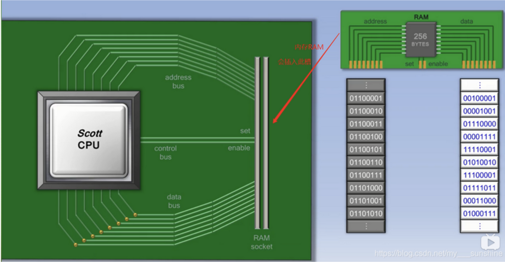
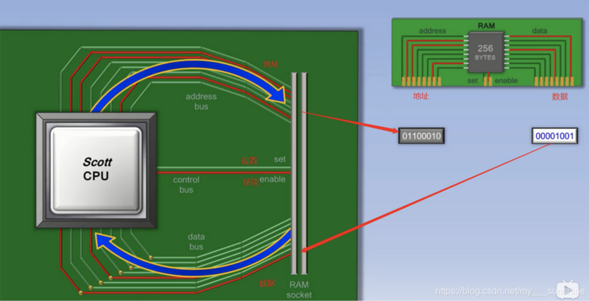
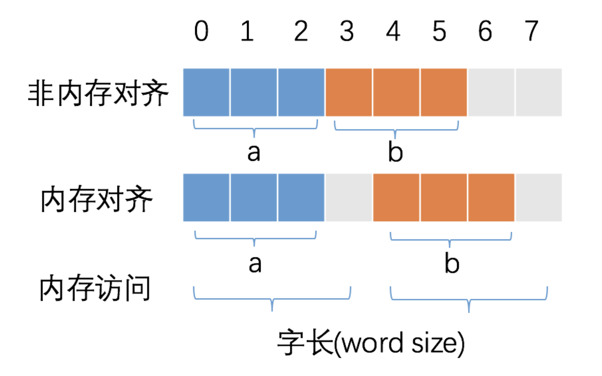

# 什么是golang内存对齐

看个代码

```go
package main

import (
    "fmt"
    "unsafe"
)

type Args struct {
    num1 int
    num2 int
}

type Flag struct {
    num1 int16
    num2 int32
}

func main() {
    fmt.Println(unsafe.Sizeof(Args{}))
    fmt.Println(unsafe.Sizeof(Flag{}))
}


# go run main.go
16
8
```

64位机器，int的大小是8个字节，那么Args大小为16字节。

但是Flags中，num1大小是2个字节，num2是4个字节，一共6个字节，那么为什么实际占用了8个字节？**多出来的2个字节就是内存对齐的结果。**

# 热身

## CPU如何读取内存？



上图是CPU与内存的简单的示意图，可以看到一共三个总线，一个地址总线（address bus），一个数据总线（data bus），一个控制总线（control bus）

图中，地址总线和数据总线是示意图，

### 读取时



1. 首先通过地址总线将地址传递给内存

# Why

我们知道CPU是有32位和64位的，这个位数表示的是CPU的总线位数，即一次数据读取能读取多少位，64位系统来说，它一次读取内存可以读取到8个字节。



如上图，当未对齐时我如果想读取b变量时，需要读取两次，第一次拿到0123，第二次拿到4567，才能拿到b的完整数据。

那么内存对齐时，我们可以看到两个受益：

1. 减少内存读取次数

2. 变量的原子访问，对于无锁的数据结构可以带来天生的原子性
